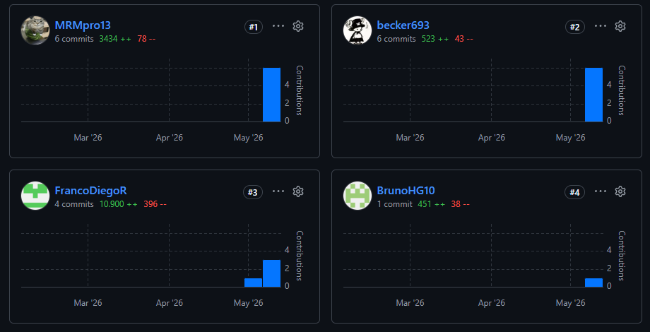

Universidad Peruana de Ciencias Aplicadas

Carrera de Ingeniería de Software

<strong>1ASI0729</strong>

<strong>Desarrollo de Aplicaciones Open Source</strong>

NRC

<strong>10177</strong>

<strong>Informe del Trabajo Final</strong>

Docente

<strong>Mori Paiva, Hugo Allan</strong>

Equipo

<strong>ByteCore</strong>

Proyecto

<strong>VITAL CARE</strong>

<strong>Integrantes</strong>

| Código | Apellidos y Nombres |
|:------:|:-------------------:|
| u201819276 | Bardales Tejada, Luis Alexis |
| U202419462 | Caisahuana Osores, Becker Junior |
| U202117762 | Huaman Gallardo, Bruno Aldair |
| U202221597 | Rioja Nuñez, Franco Diego |
| u20231e515 | Rocca Mariaca, Angel Mathias |

<strong>Período 202610</strong>

<strong>Julio 2026</strong>

# Registro de Versiones del Informe

| Versión | Fecha | Autor(es) | Descripción de cambios |
| :--- | :--- | :--- | :--- |
| 1.00 | 04/04/2026 | Rioja Nuñez, Franco Diego | Creación del reporte en formato Markdown y estructura base del informe. |
| 1.01 | 17/04/2026 | Rioja Nuñez, Franco Diego | Redacción del Capítulo I: Startup Profile, antecedentes, problemática y Lean UX Process completo. |
| 1.02 | 18/04/2026 | Huaman Gallardo, Bruno Aldair | Elaboración del Needfinding: User Personas, User Task Matrix, Journey Maps y Empathy Maps. |
| 1.03 | 19/04/2026 | Bardales Tejada, Luis Alexis | Desarrollo de diagramas de arquitectura de software: Context, Container y Component Diagrams. |
| 1.04 | 20/04/2026 | Caisahuana Osores, Becker Junior | Especificación de User Stories con criterios de aceptación en Gherkin, Impact Mapping y Product Backlog. |
| 1.05 | 21/04/2026 | Rocca Mariaca, Angel Mathias | Documentación del Capítulo IV: Style Guidelines, Information Architecture y diseño UX/UI en Figma. |
| 1.06 | 21/04/2026 | Rocca Mariaca, Angel Mathias | Implementación y despliegue de la Landing Page en GitHub Pages. |
| 1.07 | 22/04/2026 | Bardales Tejada, Luis Alexis | Redacción de entrevistas del Needfinding y sección de diseño móvil. |
| 1.08 | 23/04/2026 | Rioja Nuñez, Franco Diego | Redacción del Capítulo V: Software Configuration Management y evidencias del Sprint 1. |
| 1.09 | 23/04/2026 | Rioja Nuñez, Franco Diego | Revisión general del informe y cierre del AV1. |
| 2.00 | 07/05/2026 | Rioja Nuñez, Franco Diego | Creación del Capítulo V: Evidencias del Sprint 2, development evidence, execution evidence y deployment evidence. |
| 2.01 | 08/05/2026 | Bardales Tejada, Luis Alexis | Actualización de Service Documentation y Cloud Deployment Configuration para TB1. |
| 2.02 | 09/05/2026 | Huaman Gallardo, Bruno Aldair | Redacción de Team Collaboration Insights durante Sprint 2 con evidencias de commits y analíticos de GitHub. |
| 2.03 | 10/05/2026 | Caisahuana Osores, Becker Junior | Implementación y documentación de mejoras en API documentation y especificación de endpoints REST. |
| 2.04 | 11/05/2026 | Rocca Mariaca, Angel Mathias | Actualización de UX/UI design según feedback de TB1, refinamiento de wireframes y prototipos. |
| 2.05 | 12/05/2026 | Rioja Nuñez, Franco Diego | Revisión general del informe y cierre del TB1. Actualización de Project Report Collaboration Insights. |
| 3.00 | 28/05/2026 | Rioja Nuñez, Franco Diego | Creación del Capítulo V: Evidencias del Sprint 3, Sprint 4 y versión final del ciclo de vida del proyecto. |
| 3.01 | 29/05/2026 | Bardales Tejada, Luis Alexis | Incorporación de mejoras en arquitectura de software basadas en feedback de validación. Actualización de Component Diagrams. |
| 3.02 | 30/05/2026 | Huaman Gallardo, Bruno Aldair | Redacción de Validation Interviews con diseño y registro de entrevistas de ambos segmentos objetivo. |
| 3.03 | 31/05/2026 | Caisahuana Osores, Becker Junior | Documentación final de evaluaciones heurísticas y conclusiones de validación de requisitos funcionales. |
| 3.04 | 01/06/2026 | Rocca Mariaca, Angel Mathias | Finalización de mockups y wireflows, documentación de decisiones de diseño final. Despliegue de versión productiva. |
| 3.05 | 02/06/2026 | Rioja Nuñez, Franco Diego | Redacción de Conclusiones y Recomendaciones, integración de todos los capítulos y anexos finales. |
| 3.06 | 03/06/2026 | Todos los integrantes | Grabación y edición de Video About-the-Team con testimonios de cada miembro del equipo. |
| 3.07 | 04/06/2026 | Rioja Nuñez, Franco Diego | Revisión final integral del informe, validación de índices, enlaces y referencias. Actualización de Bibliography y Annexes. |

---

# Project Report Collaboration Insights

| Enlace del repositorio del informe del proyecto |
|-------------------------------------------------|
| https://github.com/1ASI0729-2610-10177-ByteCore-VitalCare/VitalCare-Proyect-Report.git                                                |

A continuación, se brindará un mayor detalle sobre las actividades realizadas en cada entrega, la participación de cada miembro de la startup y las evidencias correspondientes.

## Desarrollo del reporte

#### AV1:

## Desarrollo de Landing Page
#### AV1:

## Desarrollo de Frontend
#### TB1:

#### AV2:
## Desarrollo de Backend

## Desarrollo de Frontend

---

# Contenido

- [Registro de Versiones del Informe](#registro-de-versiones-del-informe)
- [Project Report Collaboration Insights](#project-report-collaboration-insights)
- [Student Outcome](#student-outcome)
- [Capítulo I: Introducción](#capítulo-i-introducción)
    - [1.1. Startup Profile](#11-startup-profile)
        - [1.1.1. Descripción de la Startup](#111-descripción-de-la-startup)
        - [1.1.2. Perfiles de integrantes del equipo](#112-perfiles-de-integrantes-del-equipo)
    - [1.2. Solution Profile](#12-solution-profile)
        - [1.2.1. Antecedentes y problemática](#121-antecedentes-y-problemática)
        - [1.2.2. Lean UX Process](#122-lean-ux-process)
            - [1.2.2.1. Lean UX Problem Statements](#1221-lean-ux-problem-statements)
            - [1.2.2.2. Lean UX Assumptions](#1222-lean-ux-assumptions)
            - [1.2.2.3. Lean UX Hypothesis Statements](#1223-lean-ux-hypothesis-statements)
            - [1.2.2.4. Lean UX Canvas](#1224-lean-ux-canvas)
    - [1.3. Segmentos objetivo](#13-segmentos-objetivo)
- [Capítulo II: Requirements Elicitation & Analysis](#capítulo-ii-requirements-elicitation--analysis)
    - [2.1. Competidores](#21-competidores)
        - [2.1.1. Análisis competitivo](#211-análisis-competitivo)
        - [2.1.2. Estrategias y tácticas frente a competidores](#212-estrategias-y-tácticas-frente-a-competidores)
    - [2.2. Entrevistas](#22-entrevistas)
        - [2.2.1. Diseño de entrevistas](#221-diseño-de-entrevistas)
        - [2.2.2. Registro de entrevistas](#222-registro-de-entrevistas)
        - [2.2.3. Análisis de entrevistas](#223-análisis-de-entrevistas)
    - [2.3. Needfinding](#23-needfinding)
        - [2.3.1. User Personas](#231-user-personas)
        - [2.3.2. User Task Matrix](#232-user-task-matrix)
        - [2.3.3. User Journey Mapping](#233-user-journey-mapping)
        - [2.3.4. Empathy Mapping](#234-empathy-mapping)
    - [2.4. Big Picture EventStorming](#24-big-picture-eventstorming)
    - [2.5. Ubiquitous Language](#25-ubiquitous-language)
- [Capítulo III: Requirements Specification](#capítulo-iii-requirements-specification)
    - [3.1. User Stories](#31-user-stories)
    - [3.2. Impact Mapping](#32-impact-mapping)
    - [3.3. Product Backlog](#33-product-backlog)
- [Capítulo IV: Product Design](#capítulo-iv-product-design)
    - [4.1. Style Guidelines](#41-style-guidelines)
        - [4.1.1. General Style Guidelines](#411-general-style-guidelines)
        - [4.1.2. Web Style Guidelines](#412-web-style-guidelines)
    - [4.2. Information Architecture](#42-information-architecture)
        - [4.2.1. Organization Systems](#421-organization-systems)
        - [4.2.2. Labeling Systems](#422-labeling-systems)
        - [4.2.3. SEO Tags and Meta Tags](#423-seo-tags-and-meta-tags)
        - [4.2.4. Searching Systems](#424-searching-systems)
        - [4.2.5. Navigation Systems](#425-navigation-systems)
    - [4.3. Landing Page UI Design](#43-landing-page-ui-design)
        - [4.3.1. Landing Page Wireframe](#431-landing-page-wireframe)
        - [4.3.2. Landing Page Mock-up](#432-landing-page-mock-up)
    - [4.4. Web Applications UX/UI Design](#44-web-applications-uxui-design)
        - [4.4.1. Web Applications Wireframes](#441-web-applications-wireframes)
        - [4.4.2. Web Applications Wireflow Diagrams](#442-web-applications-wireflow-diagrams)
        - [4.4.3. Web Applications Mock-ups](#443-web-applications-mock-ups)
        - [4.4.4. Web Applications User Flow Diagrams](#444-web-applications-user-flow-diagrams)
    - [4.5. Web Applications Prototyping](#45-web-applications-prototyping)
    - [4.6. Domain-Driven Software Architecture](#46-domain-driven-software-architecture)
        - [4.6.1. Design-Level EventStorming](#461-design-level-eventstorming)
        - [4.6.2. Software Architecture Context Diagram](#462-software-architecture-context-diagram)
        - [4.6.3. Software Architecture Container Diagrams](#463-software-architecture-container-diagrams)
        - [4.6.4. Software Architecture Components Diagrams](#464-software-architecture-components-diagrams)
    - [4.7. Software Object-Oriented Design](#47-software-object-oriented-design)
        - [4.7.1. Class Diagrams](#471-class-diagrams)
    - [4.8. Database Design](#48-database-design)
        - [4.8.1. Database Diagrams](#481-database-diagrams)
- [Capítulo V: Product Implementation, Validation & Deployment](#capítulo-v-product-implementation-validation--deployment)
    - [5.1. Software Configuration Management](#51-software-configuration-management)
        - [5.1.1. Software Development Environment Configuration](#511-software-development-environment-configuration)
        - [5.1.2. Source Code Management](#512-source-code-management)
        - [5.1.3. Source Code Style Guide & Conventions](#513-source-code-style-guide--conventions)
        - [5.1.4. Software Deployment Configuration](#514-software-deployment-configuration)
    - [5.2. Landing Page, Services & Applications Implementation](#52-landing-page-services--applications-implementation)
        - [5.2.1. Sprint 1](#521-sprint-1)
            - [5.2.1.1. Sprint Planning 1](#5211-sprint-planning-1)
            - [5.2.1.2. Aspect Leaders and Collaborators](#5212-aspect-leaders-and-collaborators)
            - [5.2.1.3. Sprint Backlog 1](#5213-sprint-backlog-1)
            - [5.2.1.4. Development Evidence for Sprint Review](#5214-development-evidence-for-sprint-review)
            - [5.2.1.5. Execution Evidence for Sprint Review](#5215-execution-evidence-for-sprint-review)
            - [5.2.1.6. Services Documentation Evidence for Sprint Review](#5216-services-documentation-evidence-for-sprint-review)
            - [5.2.1.7. Software Deployment Evidence for Sprint Review](#5217-software-deployment-evidence-for-sprint-review)
            - [5.2.1.8. Team Collaboration Insights during Sprint](#5218-team-collaboration-insights-during-sprint)
    - [5.3. Validation Interviews](#53-validation-interviews)
        - [5.3.1. Diseño de Entrevistas](#531-diseño-de-entrevistas)
        - [5.3.2. Registro de Entrevistas](#532-registro-de-entrevistas)
        - [5.3.3. Evaluaciones según heurísticas](#533-evaluaciones-según-heurísticas)
    - [5.4. Video About-the-Product](#54-video-about-the-product)
- [Conclusiones](#conclusiones)
    - [Conclusiones y recomendaciones](#conclusiones-y-recomendaciones)
    - [Video About-the-Team](#video-about-the-team)
- [Bibliografía](#bibliografía)
- [Anexos](#anexos)

---

# Student Outcome

El curso contribuye al cumplimiento del Student Outcome ABET:

**ABET – EAC - Student Outcome 3**
Criterio: Capacidad de comunicarse efectivamente con un rango de audiencias.

En el siguiente cuadro se describe las acciones realizadas y enunciados de conclusiones por parte del grupo, que permiten sustentar el haber alcanzado el logro del ABET – EAC - Student Outcome 3.

# Student Outcome

El curso contribuye al cumplimiento del Student Outcome ABET:

**ABET – EAC - Student Outcome 3**
Criterio: Capacidad de comunicarse efectivamente con un rango de audiencias.

En el siguiente cuadro se describe las acciones realizadas y enunciados de conclusiones por parte del grupo, que permiten sustentar el haber alcanzado el logro del ABET – EAC - Student Outcome 3.

| Criterio específico | Acciones realizadas | Conclusiones |
|---------------------|---------------------|--------------|
| Comunica oralmente con efectividad a diferentes rangos de audiencia. | Bardales Tejada, Luis Alexis   **AV1:** Participó en la exposición del proyecto explicando los artefactos de arquitectura de software (Context, Container y Component Diagrams) y los hallazgos del proceso de Needfinding ante el equipo y el docente.    Caisahuana Osores, Becker Junior   **AV1:** Expuso los User Stories, el Impact Mapping y el Product Backlog durante la presentación del Sprint 1, comunicando de forma clara las funcionalidades priorizadas para el producto.    Huaman Gallardo, Bruno Aldair   **AV1:** Presentó oralmente los resultados del proceso de Needfinding, incluyendo User Personas, User Task Matrix, Journey Maps y Empathy Maps, dirigiéndose tanto al equipo como al docente como audiencias.    Rioja Nuñez, Franco Diego   **AV1:** Lideró la presentación general del proyecto, exponiendo el Capítulo I (perfil de la startup, problemática, Lean UX Process y segmentos objetivo) y el Capítulo V (configuración de software y evidencias del Sprint 1).    Rocca Mariaca, Angel Mathias   **AV1:** Expuso el diseño UX/UI de la plataforma, presentando las decisiones de Style Guidelines, Information Architecture, wireframes, mockups y la Landing Page implementada ante el docente y compañeros. | El equipo demostró capacidad para comunicar oralmente los resultados del proyecto a diferentes audiencias, adaptando el nivel de detalle técnico según el contexto de la exposición. Cada integrante asumió la presentación de los artefactos que desarrolló, evidenciando dominio del contenido y coherencia en la comunicación del producto VITAL CARE. |
| Comunica por escrito con efectividad a diferentes rangos de audiencia. | Bardales Tejada, Luis Alexis   **AV1:** Redactó la sección de Needfinding (User Personas, User Task Matrix, User Journey Mapping y Empathy Mapping), documentando los hallazgos del análisis de usuarios de forma clara y estructurada en el informe. Adicionalmente elaboró los diagramas de arquitectura de software (Context, Container y Component Diagrams).    Caisahuana Osores, Becker Junior   **AV1:** Redactó los User Stories con criterios de aceptación en formato Gherkin, el Impact Mapping y el Product Backlog, asegurando que los requisitos del sistema quedaran documentados de forma precisa y comprensible para distintas audiencias.    Huaman Gallardo, Bruno Aldair   **AV1:** Documentó el proceso completo de Needfinding en el informe, redactando las fichas de User Persona, User Task Matrix, User Journey Maps y Empathy Maps con un lenguaje claro dirigido tanto a audiencias técnicas como no técnicas.    Rioja Nuñez, Franco Diego   **AV1:** Redactó el Capítulo I del informe (descripción de la startup ByteCore, antecedentes y problemática con técnica 5W+2H, Lean UX Process completo y segmentos objetivo) y el Capítulo V (Software Configuration Management y evidencias del Sprint 1), comunicando por escrito el proceso de ingeniería de forma estructurada.    Rocca Mariaca, Angel Mathias   **AV1:** Documentó el Capítulo IV del informe (Style Guidelines, Information Architecture, Landing Page UI Design y Web Applications UX/UI Design), redactando las decisiones de diseño de forma clara y sustentada para audiencias técnicas y no técnicas. Adicionalmente implementó y desplegó la Landing Page. | El equipo evidenció capacidad para comunicar por escrito los resultados y procesos de ingeniería de software de forma efectiva. La documentación del informe refleja un lenguaje técnico apropiado, una estructura coherente y una redacción orientada a distintas audiencias, desde el docente evaluador hasta potenciales usuarios del producto VITAL CARE. |

---

# Anexos
Videos entrevistas:

https://drive.google.com/drive/folders/1n5E5qsEPfzvnT6jPQUm_v1J_U5d-TlO7

https://www.youtube.com/watch?v=8G71Ly59jJI

## Videos de Exposiciones

| Entrega | Título           | Enlace |
|---------|------------------|--------|
| AV1 | Video expositivo |https://drive.google.com/drive/u/0/folders/1nZCNehZphhS1CCIH3H4GGSHjwF1umuln |
| TB1 | Video expositivo                 |https://drive.google.com/drive/folders/12FXN3sjbLm0tETEGi1krfNRxIMchk2en |
| AV2 |    Video expositivo              | https://drive.google.com/drive/folders/12L7r2QUOTuU8LNGT29PDVgPHP1RaQXQx?usp=sharing|
| TB2 |            Video expositivo      | |