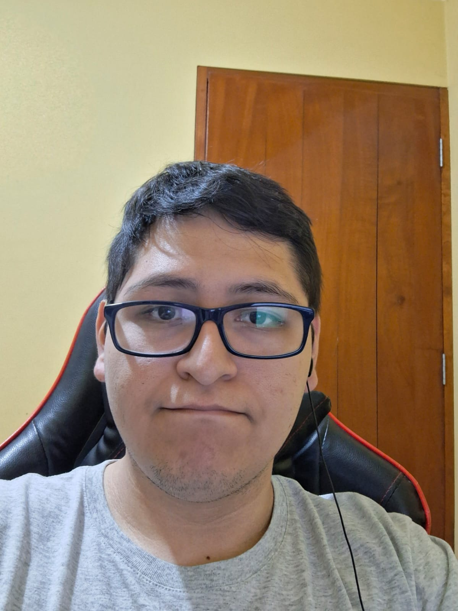
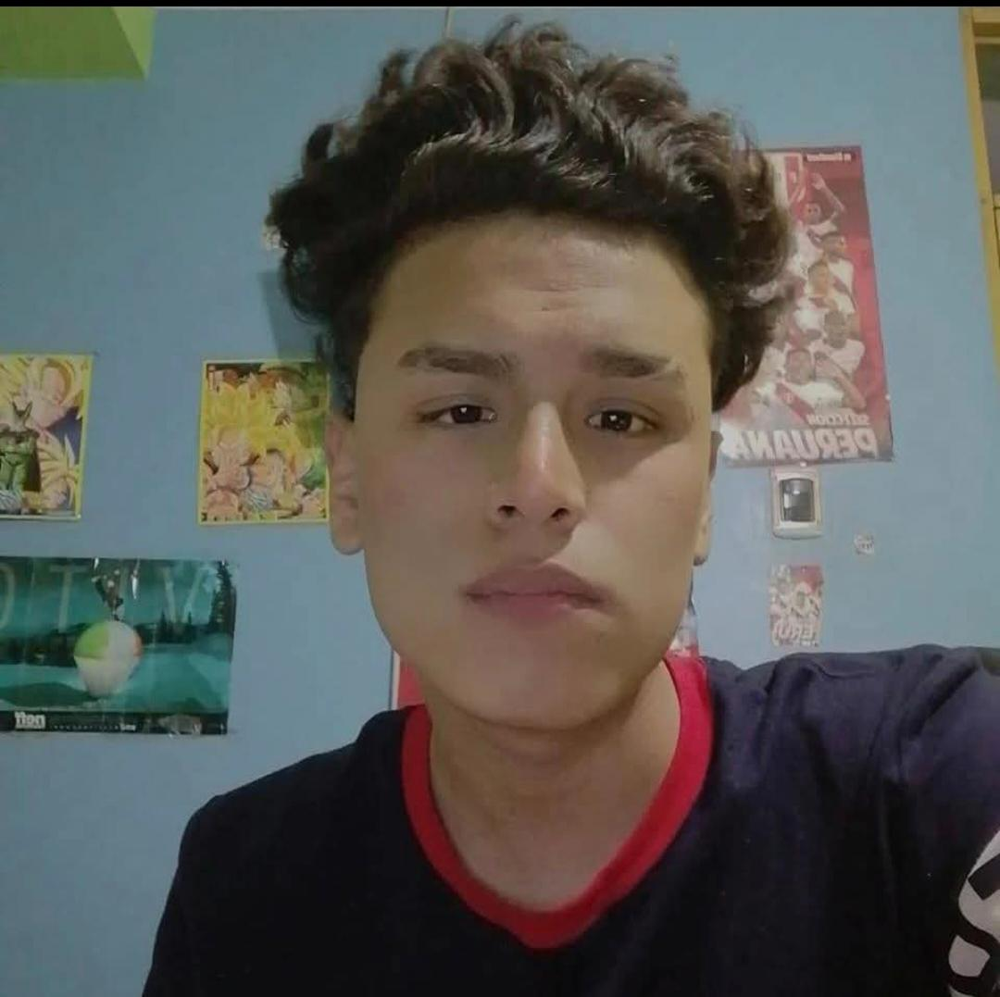
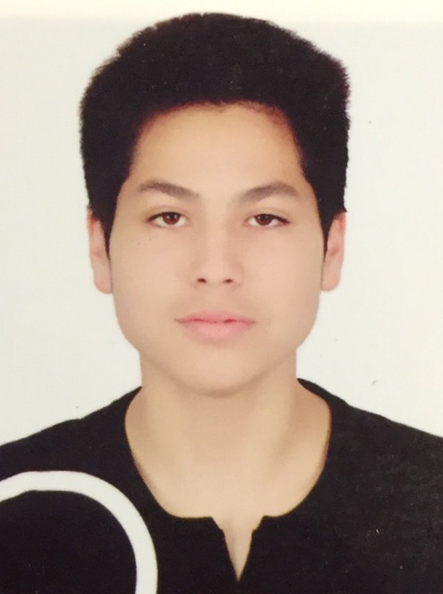

# Capítulo I: Introducción

## 1.1. Startup Profile

### 1.1.1. Descripción de la Startup

ByteCore es una startup de ingeniería de software enfocada en el desarrollo de soluciones digitales orientadas al sector salud. Nuestro propósito es reducir la brecha entre los pacientes vulnerables y el acceso a un monitoreo médico continuo, aprovechando tecnologías web e IoT para brindar tranquilidad tanto a los pacientes como a sus familias.

Nuestro producto principal, **VITAL CARE**, es una plataforma web de monitoreo remoto de signos vitales que integra dispositivos IoT (parche) para el seguimiento en tiempo real de pacientes con enfermedades crónicas y adultos mayores, permitiendo la detección temprana de anomalías y la generación de alertas automáticas ante situaciones críticas. La plataforma opera bajo un modelo freemium con dos planes: un **Plan Básico gratuito** que permite el registro de un paciente, visualización de signos vitales en tiempo real, alertas básicas e historial de los últimos 3 días; y un **Plan Premium a $9.99 mensuales** que habilita el registro de múltiples pacientes, historial completo, alertas avanzadas, notificaciones automáticas por push o email, e integración con datos climáticos para alertas preventivas.

**Misión:** Democratizar el acceso al monitoreo continuo de salud en el hogar, brindando herramientas digitales que permitan una respuesta oportuna ante emergencias médicas.

**Visión:** Ser la plataforma de referencia en monitoreo remoto de salud en Latinoamérica, contribuyendo a mejorar la calidad de vida de los adultos mayores y pacientes con enfermedades crónicas.

### 1.1.2. Perfiles de integrantes del equipo

| **Nombre y Apellido** | Angel Mathias Rocca Mariaca |
|:----------------------|:----------------------------|
| **Descripción**       | Soy estudiante de Ingeniería de Software y me caracterizo por mi disposición al aprendizaje continuo. Me gusta escuchar diferentes perspectivas, adaptarme a nuevos retos y trabajar con dedicación. Mi meta es aportar valor a los proyectos en los que participe y seguir creciendo como profesional en el área tecnológica. |
| **Foto**              |  |

| **Nombre y Apellido** | Franco Diego Rioja Nuñez |
|:----------------------|:-------------------------|
| **Descripción**       | Tengo 21 años y actualmente curso el séptimo ciclo de la carrera. Me considero una persona proactiva y comprometida en el desarrollo de proyectos, además de ser colaborativa y atenta a las necesidades y problemas de mis compañeros de equipo. En paralelo, me encuentro llevando cursos de especialización en Análisis de Datos, con el objetivo de ampliar mis conocimientos y fortalecer mis competencias profesionales. |
| **Foto**              |  |

| **Nombre y Apellido** | Bruno Aldair Huaman Gallardo                                                                                                                                                                                                                                                                                                                      |
|:----------------------|:--------------------------------------------------------------------------------------------------------------------------------------------------------------------------------------------------------------------------------------------------------------------------------------------------------------------------------------------------|
| **Descripción**       | Soy estudiante de Ingeniería de Software con interés en el desarrollo de soluciones tecnológicas orientadas al usuario. Me caracterizo por ser responsable, analítico y comprometido con la calidad del trabajo en equipo. Busco seguir desarrollando mis habilidades técnicas y contribuir de forma activa en cada proyecto en el que participo. |
| **Foto**              |                                                                                                                                                                                                                                                         |

| **Nombre y Apellido** | Becker Junior Caisahuana Osores |
|:----------------------|:--------------------------------|
| **Descripción**       | Soy estudiante de Ingeniería de Software con motivación por el diseño y la especificación de requisitos de software. Me considero una persona organizada, detallista y con capacidad para trabajar en entornos colaborativos. Mi objetivo es seguir creciendo en el área del desarrollo de software y aportar soluciones innovadoras a los proyectos del equipo. |
| **Foto**              |  |

| **Nombre y Apellido** | Luis Alexis Bardales Tejada |
|:----------------------|:----------------------------|
| **Descripción**       | Soy estudiante de Ingeniería de Software con interés en el análisis de usuarios y la arquitectura de software. Me caracterizo por ser curioso, proactivo y orientado a la investigación. Disfruto entender las necesidades de los usuarios para traducirlas en soluciones tecnológicas efectivas, y me esfuerzo por contribuir con calidad en cada etapa del desarrollo de los proyectos. |
| **Foto**              |  |

## 1.2. Solution Profile

### 1.2.1. Antecedentes y problemática

En el Perú, el envejecimiento poblacional y el incremento de enfermedades crónicas representan uno de los principales desafíos del sistema de salud. Una proporción significativa de adultos mayores y pacientes con condiciones como hipertensión, diabetes o insuficiencia cardíaca reside en sus hogares sin acceso a un monitoreo médico continuo, dependiendo de visitas esporádicas a centros de salud o de la supervisión intermitente de familiares.

Esta situación se ve agravada por tres factores clave. En primer lugar, la falta de acceso constante a servicios médicos, dado que los controles presenciales son periódicos y no permiten detectar variaciones críticas en los signos vitales de forma oportuna. En segundo lugar, la escasa supervisión en tiempo real por parte de familiares, quienes en muchos casos trabajan o no residen con el paciente, lo que limita su capacidad de respuesta ante una emergencia. En tercer lugar, la reacción tardía ante situaciones como fiebre alta o alteraciones cardíacas, que al no ser detectadas a tiempo pueden derivar en complicaciones graves o incluso en la muerte del paciente.

Aplicando la técnica de las 5W y 2H, el problema se puede describir de la siguiente manera:

- **Who (Quién):** Adultos mayores de 60 años con enfermedades crónicas que viven solos o con supervisión parcial, y sus familiares o cuidadores de entre 25 y 40 años residentes en zonas urbanas.
- **What (Qué):** Ausencia de un sistema de monitoreo continuo de signos vitales en el hogar que permita detectar anomalías en tiempo real y generar alertas oportunas.
- **Where (Dónde):** Principalmente en zonas urbanas del Perú, donde existe mayor acceso a conectividad digital, aunque la problemática se extiende a nivel nacional.
- **When (Cuándo):** De manera permanente, dado que las condiciones crónicas requieren seguimiento constante, y de forma crítica en momentos de descompensación del paciente.
- **Why (Por qué):** Porque el sistema de salud no cuenta con la capacidad para ofrecer monitoreo domiciliario continuo a escala, y las familias no disponen de herramientas accesibles para supervisar remotamente el estado de salud de sus seres queridos.
- **How (Cómo):** A través de una plataforma web integrada con dispositivos IoT que reciben, procesan y visualizan datos de signos vitales en tiempo real, generando alertas automáticas ante valores críticos.
- **How Much (Cuánto):** El costo de no contar con este monitoreo se traduce en hospitalizaciones de emergencia, complicaciones evitables y deterioro de la calidad de vida del paciente, con un impacto tanto económico como emocional en las familias.
### 1.2.2. Lean UX Process

#### 1.2.2.1. Lean UX Problem Statements

**Problem Statement 1: Familiares y cuidadores**

Nuestro entorno evidencia que los familiares y cuidadores de adultos mayores con enfermedades crónicas no cuentan con herramientas digitales accesibles que les permitan monitorear remotamente el estado de salud de sus seres queridos en tiempo real. Hemos observado que esto genera angustia, reacción tardía ante emergencias y una carga emocional significativa en el cuidador. ¿Cómo podríamos ofrecer a los familiares y cuidadores una solución que les brinde visibilidad continua del estado de salud del paciente y les permita actuar de forma oportuna ante cualquier anomalía?

**Problem Statement 2: Adultos mayores con enfermedades crónicas**

Nuestro entorno evidencia que los adultos mayores con enfermedades crónicas que viven solos o con supervisión parcial son altamente vulnerables a complicaciones médicas graves, dado que no existe un mecanismo que detecte de forma automática variaciones críticas en sus signos vitales y genere alertas en tiempo real. ¿Cómo podríamos garantizar un monitoreo continuo y no invasivo de los signos vitales de estos pacientes, de modo que tanto ellos como sus familias puedan recibir alertas oportunas ante situaciones de riesgo?

#### 1.2.2.2. Lean UX Assumptions

**Business Assumptions**

1. Creemos que nuestros usuarios necesitan una forma accesible y confiable de monitorear los signos vitales de sus familiares mayores o pacientes crónicos desde cualquier lugar, sin requerir presencia física constante.
2. El valor principal que un cliente quiere obtener de VITAL CARE es la tranquilidad de saber que su familiar está siendo monitoreado en tiempo real y que recibirá una alerta inmediata si algo sale mal.
3. El cliente también puede obtener como beneficio adicional el acceso a un historial de signos vitales que le permita mostrar información objetiva al médico tratante en sus consultas periódicas.
4. Vamos a adquirir la mayoría de nuestros clientes a través de redes sociales, principalmente Facebook e Instagram, con contenido orientado a familias que cuidan adultos mayores, dado que es el canal de mayor alcance y menor costo para una startup en etapa inicial.
5. El mayor riesgo del producto es que los usuarios adultos mayores presenten dificultades para interactuar con la aplicación por falta de familiaridad con la tecnología, que el dispositivo IoT resulte económicamente inaccesible para parte del segmento objetivo, y que los nuevos usuarios desconfíen de la plataforma al tratarse de una empresa recientemente lanzada al mercado.
6. Resolveremos estos riesgos mediante una interfaz diseñada con principios de usabilidad inclusiva, una estrategia de precios con plan básico gratuito que reduzca la barrera de entrada, y construyendo confianza a través de transparencia en el manejo de datos y testimonios reales de usuarios tempranos.
7. Generaremos ingresos a través de un modelo freemium: Plan Básico gratuito y Plan Premium a $9.99 mensuales.
8. Nuestro principal competidor son las soluciones de monitoreo hospitalario y los dispositivos wearables de marcas establecidas, sin embargo, ninguno ofrece una plataforma web integrada con IoT accesible para el hogar en el contexto peruano.
9. Nuestra mayor ventaja competitiva es la combinación de monitoreo IoT en tiempo real con alertas automáticas y un modelo de precios accesible, adaptado a la realidad del mercado local.
   **User Assumptions**

1. **¿Quién es el usuario?** Existen dos perfiles: familiares o cuidadores de entre 25 y 40 años con acceso a dispositivos digitales y conectividad, y adultos mayores de 60 años con enfermedades crónicas que requieren supervisión continua de sus signos vitales.
2. **¿Dónde encaja nuestro producto en su vida?** Para los familiares, VITAL CARE se integra en su rutina diaria como una herramienta de monitoreo remoto que les da tranquilidad mientras realizan sus actividades. Para el adulto mayor, el dispositivo IoT convive en su hogar de forma discreta y continua.
3. **¿Qué problema resuelve nuestro producto?** Elimina la incertidumbre del familiar sobre el estado de salud del paciente y reduce el riesgo de reacción tardía ante emergencias médicas como fiebre alta o alteraciones cardíacas.
4. **¿Cuándo y cómo es usado?** El familiar accede a la plataforma web desde su celular o computadora en cualquier momento del día. El sistema opera de forma continua en segundo plano, generando alertas automáticas únicamente cuando se detectan valores fuera del rango normal.
5. **¿Qué características son las más importantes?** La visualización de signos vitales en tiempo real, las alertas automáticas ante valores críticos y el historial de datos para el seguimiento médico son las funcionalidades de mayor valor percibido para ambos segmentos.
6. **¿Cómo debe verse y comportarse nuestro producto?** La interfaz debe ser simple, clara y con elementos visuales de fácil comprensión, especialmente pensada para usuarios con poca experiencia tecnológica. Las alertas deben ser inmediatas, visibles y comprensibles sin requerir interpretación técnica.
#### 1.2.2.3. Lean UX Hypothesis Statements

**Hipótesis 1**
Creemos que lograr que los familiares y cuidadores reduzcan su tiempo de reacción ante emergencias médicas para el segmento de adultos entre 25 y 40 años usando alertas automáticas en tiempo real. Sabremos que es verdad cuando veamos que al menos el 80% de las alertas críticas generadas son atendidas por el familiar dentro de los primeros 10 minutos.

**Hipótesis 2**
Creemos que lograr que los adultos mayores con enfermedades crónicas sean monitoreados de forma continua sin intervención activa de su parte para el segmento de pacientes de 60 años a más usando el dispositivo IoT integrado a la plataforma. Sabremos que es verdad cuando veamos que el dispositivo permanece activo y transmitiendo datos de forma ininterrumpida en al menos el 90% del tiempo en los hogares de los usuarios registrados.

**Hipótesis 3**
Creemos que lograr que nuevos usuarios adopten la plataforma sin barreras económicas iniciales para ambos segmentos usando el Plan Básico gratuito como punto de entrada. Sabremos que es verdad cuando veamos que VITAL CARE alcanza 200 usuarios registrados dentro de los primeros 6 meses desde su lanzamiento.

**Hipótesis 4**
Creemos que lograr convertir usuarios del plan gratuito en suscriptores de pago para el segmento de familiares y cuidadores usando las funcionalidades exclusivas del Plan Premium como historial completo, alertas avanzadas y notificaciones push o email. Sabremos que es verdad cuando veamos que al menos el 20% de los usuarios del Plan Básico migran al Plan Premium dentro de los primeros 3 meses de uso.

**Hipótesis 5**
Creemos que lograr generar confianza en la plataforma entre usuarios que desconocen ByteCore como empresa para ambos segmentos usando una estrategia de contenido en redes sociales con testimonios reales y una interfaz transparente sobre el manejo de datos de salud. Sabremos que es verdad cuando veamos una tasa de retención mensual del 70% o más en usuarios activos durante los primeros 6 meses.

**Hipótesis 6**
Creemos que lograr que los familiares perciban valor adicional en la integración de datos climáticos para el segmento de cuidadores con Plan Premium usando alertas preventivas basadas en condiciones ambientales combinadas con los signos vitales del paciente. Sabremos que es verdad cuando veamos que esta funcionalidad es valorada positivamente por al menos el 65% de los usuarios Premium en encuestas de satisfacción realizadas al tercer mes.

#### 1.2.2.4. Lean UX Canvas

A continuación se presenta el Lean UX Canvas elaborado por el equipo, que resume los elementos clave del proceso Lean UX aplicado al desarrollo de VITAL CARE.

| Bloque | Contenido |
|--------|-----------|
| **1. Business Problem** | Los adultos mayores con enfermedades crónicas y sus familias carecen de una herramienta accesible que permita el monitoreo continuo de signos vitales en el hogar, generando reacciones tardías ante emergencias médicas y una carga emocional elevada en los cuidadores. |
| **2. Business Outcomes** | Alcanzar 200 usuarios registrados en 6 meses. Lograr una tasa de conversión del 20% de plan básico a premium en 3 meses. Mantener una retención mensual del 70% en usuarios activos. |
| **3. Users & Customers** | Segmento 1: Familiares y cuidadores de 25 a 40 años residentes en zonas urbanas. Segmento 2: Adultos mayores de 60 años con enfermedades crónicas. |
| **4. User Benefits** | Tranquilidad y visibilidad continua del estado de salud del paciente. Reducción del tiempo de reacción ante emergencias. Acceso a historial de signos vitales para consultas médicas. |
| **5. Solution Ideas** | Plataforma web con visualización de signos vitales en tiempo real. Alertas automáticas ante valores críticos. Historial de datos. Integración con datos climáticos para alertas preventivas. Plan básico gratuito y plan premium a $9.99 mensuales. |
| **6. Hypotheses** | Si ofrecemos alertas en tiempo real, los familiares reaccionarán en menos de 10 minutos ante emergencias. Si el plan básico es gratuito, alcanzaremos 200 registros en 6 meses. Si el plan premium agrega valor real, el 20% de usuarios básicos migrarán en 3 meses. |
| **7. What's the most important thing we need to learn first?** | Si los usuarios confían en una plataforma de salud de una startup nueva y si el costo del dispositivo IoT representa una barrera de adopción real para nuestros segmentos objetivo. |
| **8. What's the least amount of work we need to do to learn this?** | Lanzar el plan básico gratuito con las funcionalidades core (monitoreo y alertas básicas) y recolectar feedback de los primeros 50 usuarios sobre usabilidad, confianza y disposición a pagar por el plan premium. |
 
---

## 1.3. Segmentos objetivo

VITAL CARE está dirigido a dos segmentos objetivos claramente identificados:

**Segmento objetivo 1: Familiares y cuidadores de pacientes**

Adultos de entre 25 y 40 años que tienen a su cargo el cuidado de un familiar mayor o con enfermedad crónica. Residen principalmente en zonas urbanas del Perú, donde cuentan con acceso a conectividad digital que les permite aprovechar las funcionalidades de la plataforma. Este segmento se caracteriza por su preocupación activa por la salud de sus seres queridos y por la necesidad de contar con herramientas que les permitan realizar un monitoreo remoto en tiempo real, así como recibir alertas inmediatas ante situaciones de riesgo, sin requerir su presencia física permanente junto al paciente.

**Segmento objetivo 2: Adultos mayores con enfermedades crónicas**

Personas de 60 años a más que padecen enfermedades crónicas como hipertensión, diabetes o enfermedades cardíacas. Viven solos o con supervisión parcial y requieren un seguimiento constante de sus signos vitales debido a su vulnerabilidad ante emergencias médicas. Este segmento se beneficia directamente del monitoreo continuo proporcionado por el dispositivo IoT asociado a la plataforma, que permite detectar anomalías de forma temprana y activar alertas antes de que una situación derive en una complicación grave.