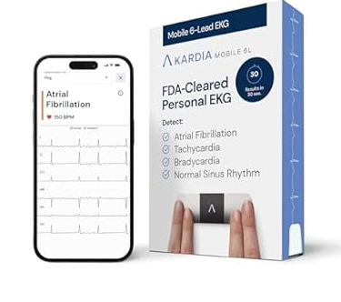
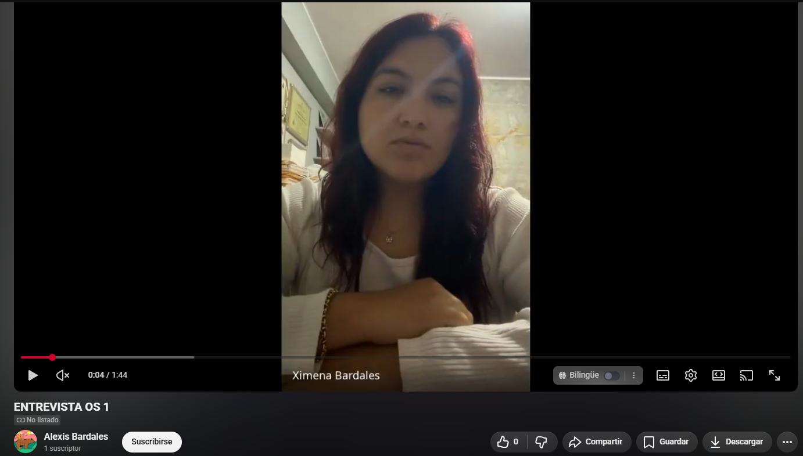

# Capítulo II: Requirements Elicitation & Analysis

Capítulo II: Requirements Elicitation & Analysis

2.1. Competidores

En el mercado de soluciones tecnológicas para la salud y el monitoreo remoto de pacientes, existen diversas plataformas que ofrecen servicios de supervisión de signos vitales. A continuación, se detallan los competidores clave identificados:

•	Fitbit (Google Health): Competidor indirecto. Es una de las plataformas de consumo más populares. Permite a los usuarios monitorear la frecuencia cardíaca, el sueño y la actividad física. Si bien está enfocada en el bienestar general, muchos cuidadores la utilizan para supervisar a adultos mayores, aunque carece de un sistema de alertas médicas críticas integrado para terceros.

•	KardiaMobile (AliveCor): Competidor directo en tecnología. Dispositivo IoT especializado en la detección de anomalías cardíacas con alertas.

•	CuidaCare: Competidor directo en segmento. Plataforma de gestión de cuidadores para adultos mayores, aunque con menor enfoque en la captura automática de datos IoT.

2.1.1 Análisis competitivo

<table>
  <tr>
    <th colspan="6">Competitive Analysis Landscape - Project: VITAL CARE</th>
  </tr>
  <tr>
    <td colspan="1">¿Por qué llevar a cabo el análisis?</td>
    <td colspan="5">El análisis competitivo es fundamental para identificar los puntos fuertes y débiles de VitalCare frente a gigantes del mercado de salud digital y wearables. Esto nos permite posicionar nuestra ventaja en la automatización IoT de bajo costo y el enfoque específico en cuidadores de adultos mayores en entornos urbanos, diferenciándonos de soluciones fitness o clínicas de alto costo.</td>
  </tr>
  <tr>
    <td colspan="2"></td>
    <td><b>VitalCare</b></td>
    <td><b>Fitbit (Google)</b></td>
    <td><b>KardiaMobile</b></td>
    <td><b>CuidaCare</b></td>
  </tr>
  <tr>
    <td colspan="2">Logo</td>
    <td></td>
    <td></td>
    <td></td>
    <td></td>
  </tr>
  <tr>
    <td rowspan="2">Perfil</td>
    <td>Overview</td>
    <td>Plataforma web de monitoreo remoto que utiliza dispositivos IoT (ESP32/Arduino) para obtener signos vitales en tiempo real, detectando anomalías y generando alertas automáticas para familiares en zonas urbanas.</td>
    <td>Ecosistema líder de wearables (pulseras y relojes) enfocado en el seguimiento de actividad física, calidad del sueño y métricas de salud general a través de hardware propietario estético.</td>
    <td>Dispositivo médico portátil con certificación clínica especializado en realizar electrocardiogramas (ECG) instantáneos para detectar arritmias desde un smartphone.</td>
    <td>Aplicación móvil diseñada para la gestión logística del cuidado, permitiendo organizar tareas, recordatorios de medicación y comunicación entre múltiples cuidadores.</td>
  </tr>
  <tr>
    <td>Ventaja competitiva ¿Qué valor ofrece a los clientes?</td>
    <td>Automatización total mediante hardware Open Source de bajo costo y alertas críticas preventivas, permitiendo una supervisión constante sin depender del registro manual del paciente.</td>
    <td>Marca global consolidada con un ecosistema de hardware muy estético, funcional y una comunidad de usuarios masiva respaldada por la infraestructura de Google.</td>
    <td>Alta precisión y validación de grado médico (FDA) en sus sensores, brindando confianza absoluta en el diagnóstico de condiciones cardíacas específicas.</td>
    <td>Optimización de la organización humana y logística, reduciendo el error en la administración de medicinas y mejorando la comunicación en familias con enfermeros externos.</td>
  </tr>
  <tr>
    <td rowspan="2">Perfil de Marketing</td>
    <td>Mercado Objetivo</td>
    <td>Familiares (25-50 años) que cuidan adultos mayores en zonas urbanas de Perú, con preocupación por emergencias médicas y necesidad de tranquilidad remota.</td>
    <td>Personas jóvenes y adultas activas, entusiastas del fitness y usuarios que buscan prevención de salud general a través de un estilo de vida saludable.</td>
    <td>Pacientes con antecedentes cardíacos, arritmias o condiciones específicas que requieren monitoreo clínico puntual pero frecuente.</td>
    <td>Familias que dependen de cuidadores externos, agencias de enfermería o múltiples familiares rotativos para la atención de un paciente.</td>
  </tr>
  <tr>
    <td>Estrategias de Marketing</td>
    <td>Marketing de contenidos sobre salud digital y alianzas estratégicas con comunidades de cuidado al adulto mayor y tecnología abierta.</td>
    <td>Publicidad masiva en medios digitales, uso de influencers de bienestar y presencia física en los principales retailers tecnológicos (iShop, Coolbox).</td>
    <td>Alianzas directas con cardiólogos, recomendación médica profesional y distribución especializada en farmacias y Amazon.</td>
    <td>Estrategia de boca a boca y presencia directa en agencias de enfermería privada y grupos de apoyo para cuidadores.</td>
  </tr>
  <tr>
    <td rowspan="3">Perfil de Producto</td>
    <td>Productos y Servicios</td>
    <td>Aplicación Web interactiva integrada con sensores IoT (ESP32), dashboard de signos vitales, alertas automáticas y reportes históricos.</td>
    <td>Variedad de dispositivos Wearables + App móvil + Suscripción Premium para análisis profundo de tendencias de salud y sueño.</td>
    <td>Hardware de bolsillo para ECG + Aplicación de análisis médico y posibilidad de compartir reportes directamente con el especialista.</td>
    <td>Suscripción a plataforma móvil de gestión de tareas, calendario de medicación y chat de coordinación para el equipo de cuidado.</td>
  </tr>
  <tr>
    <td>Precios y Costos</td>
    <td>Plan Básico: Gratis (1 paciente, 3 días de historial). Plan Premium: $4.99/mes (Múltiples pacientes, alertas avanzadas e historial completo).</td>
    <td>Costo de hardware inicial (desde $79) + Suscripción Premium opcional de $9.99/mes para funciones avanzadas.</td>
    <td>Pago único por el hardware ($99 aprox.) + Plan de reporte médico opcional bajo demanda.</td>
    <td>Modelo de suscripción mensual basado en el número de cuidadores o perfiles de pacientes registrados.</td>
  </tr>
  <tr>
    <td>Canales de distribución (Web y/o Móvil)</td>
    <td>Plataforma Web (SaaS) accesible desde cualquier navegador; notificaciones vía Web, Email o Push.</td>
    <td>Tiendas físicas minoristas, plataformas de e-commerce y App Store / Google Play.</td>
    <td>Farmacias especializadas, Amazon y sitio web oficial del fabricante.</td>
    <td>Exclusivo a través de tiendas de aplicaciones móviles (App Store y Google Play).</td>
  </tr>
  <tr>
    <td rowspan="4">Análisis SWOT</td>
    <td>Fortalezas</td>
    <td>Costo de implementación muy bajo debido al uso de tecnología Open Source y capacidad de respuesta inmediata ante crisis mediante alertas.</td>
    <td>Diseño de producto superior, integración perfecta con servicios de Google y gran autonomía de batería en sus dispositivos.</td>
    <td>Validación médica internacional, portabilidad extrema y enfoque en una necesidad crítica (salud cardíaca) con alta precisión.</td>
    <td>Facilita la gestión humana de casos complejos donde intervienen muchos cuidadores, evitando la duplicidad de tareas.</td>
  </tr>
  <tr>
    <td>Debilidades</td>
    <td>Dependencia absoluta de la conectividad a internet en el hogar del paciente y hardware que requiere mantenimiento básico del usuario.</td>
    <td>Su enfoque es demasiado general; no está diseñado específicamente para reaccionar ante emergencias médicas críticas en tiempo real.</td>
    <td>Monitoreo limitado exclusivamente al corazón; no ofrece una visión integral de otros signos vitales como temperatura o saturación.</td>
    <td>Depende totalmente del ingreso manual de datos por parte del cuidador, lo que lo hace propenso a errores humanos u olvidos.</td>
  </tr>
  <tr>
    <td>Oportunidades</td>
    <td>Crecimiento acelerado de la población adulta mayor en Perú y la falta de soluciones locales accesibles de monitoreo IoT.</td>
    <td>Potencial de integración con seguros de salud privados para ofrecer descuentos basados en métricas de vida saludable.</td>
    <td>Posibilidad de integrarse con sistemas de telemedicina de hospitales públicos para monitoreo remoto de pacientes post-operados.</td>
    <td>Digitalización de las agencias de enfermería y servicios de "Home Care" que aún utilizan registros en papel.</td>
  </tr>
  <tr>
    <td>Amenazas</td>
    <td>Competencia de dispositivos genéricos de bajo costo provenientes del mercado chino con apps integradas.</td>
    <td>Regulaciones de privacidad de datos cada vez más estrictas que podrían limitar el uso de información sensible de salud.</td>
    <td>Nuevas regulaciones sanitarias locales (DIGEMID) que podrían exigir certificaciones costosas para dispositivos médicos.</td>
    <td>Aparición de apps de telemedicina que incluyan módulos de gestión de tareas de forma gratuita.</td>
  </tr>
</table>

2.1.2. Estrategias y tácticas frente a competidores.

•	Diferenciación mediante IoT real: A diferencia de las aplicaciones de registro manual, VitalCare se distinguirá por capturar datos de forma automática, lo que evitará errores humanos y permitirá respuestas rápidas a cualquier irregularidad.

•	Transparencia de Código Abierto: Al tratarse de un proyecto de desarrollo abierto, se ayudará a aumentar la confianza en el manejo de información de salud, y se facilitará la conexión con diversos tipos de sensores económicos, disminuyendo la barrera de costos para las familias en Perú.

2.2. Entrevistas.

Segmento objetivo 1: Adultos entre 25 y 50 años que cuidan familiares: El objetivo es medir el nivel de ansiedad por la falta de supervisión y la disposición a pagar por un sistema de alertas automáticas.

•	Alertas de Prevención: Se planea usar la integración de información externa (como el clima) en el plan Premium para advertir sobre posibles riesgos de hipertensión o dificultades respiratorias antes de que sucedan.

2.2.1. Diseño de entrevista

Estructura de Encuesta: VITAL CARE

¿Cuál es su nombre, edad y distrito donde reside?

¿A qué se dedica actualmente y a quién tiene a su cargo?

¿Cuánto tiempo lleva encargándose del cuidado o supervisión de la salud de su familiar?

¿Qué dispositivos utiliza habitualmente (Celular, PC, Tablet), qué sistema operativo tienen (Android, iOS, Windows) y qué navegador usa más (Chrome, Safari, Edge)?

Segmento objetivo 1: Adultos entre 25 y 50 años que cuidan familiares: El objetivo es medir el nivel de ansiedad por la falta de supervisión y la disposición a pagar por un sistema de alertas automáticas.

1.	¿Qué tan seguido se preocupa por el estado de salud de su familiar cuando no está con él/ella?
2.	¿Cómo se entera actualmente si su familiar tiene una emergencia médica en casa?
3. ¿Cómo monitorea actualmente el estado de salud y los signos vitales de su familiar o paciente?
4. ¿Qué signos vitales (presión, temperatura, pulso) considera más críticos de monitorear?
5. ¿Qué herramientas o equipos tecnológicos utiliza actualmente para el seguimiento de salud en casa?
6. ¿Estaría dispuesto a utilizar una plataforma web para recibir alertas en su celular si algo anda mal?
7.	¿Qué valor le da a tener un historial de salud completo para mostrarle al médico en las consultas?

Segmento objetivo 2: Adultos mayores (60+) con enfermedades crónicas: El objetivo es evaluar la aceptación de la tecnología y la percepción de seguridad que les brinda el dispositivo.

1.	¿Se siente seguro quedándose solo en casa durante el día?
2.	¿Le resulta difícil recordar tomarse la temperatura o medirse la presión regularmente?
3.  ¿Cómo monitorea actualmente el estado de salud y los signos vitales de su familiar o paciente?
4.  ¿Cómo se siente con la idea de usar un pequeño dispositivo que envíe sus datos de salud a sus hijos o médicos?
5.  ¿Qué es lo que más le asusta de tener una emergencia médica cuando no hay nadie cerca?
6.  ¿Qué herramientas o equipos tecnológicos utiliza actualmente para el seguimiento de salud en casa?
7.	Si tuviera un sistema que avisa automáticamente a su familia si se siente mal, ¿le daría más tranquilidad en su vida diaria?

2.2.2. Registro de entrevistas.

| Campo | Detalle |
| :--- | :--- |
| **Entrevistada** | Briana Casarreto |
| **Edad** | 25 años |
| **Distrito** | Santiago de Surco, Lima |
| **Perfil y Experiencia** | Cuidadora con 2 años de experiencia en el sector de adultos mayores. Trabaja con pacientes que tienen limitaciones tecnológicas o de salud que les impiden comunicarse de forma autónoma. |
| **Problemática Identificada** | Dependencia crítica de terceros. Ante la falta de herramientas digitales, Briana depende de llamadas de vecinos del condominio para enterarse de emergencias (caídas o fiebre), lo que genera una brecha de información peligrosa cuando no está presente. |
| **Dificultades Principales** | Riesgo de reacción tardía ante anomalías en presión arterial y pulso. La falta de un registro constante impide detectar tendencias de salud preventivas, actuando solo cuando la emergencia ya ocurrió. |
| **Necesidad Tecnológica** | Valida la necesidad de una plataforma de alertas y registro digital. Considera que un historial completo permitiría intervenciones médicas mucho más inmediatas y precisas. |
| **Perfil Técnico** | Usuario de Android (Smartphone) y Windows (Laptop). Navegador principal: Google Chrome. |
| **Evidencia visual** | / [Link al Video](https://drive.google.com/file/d/1LmHdxIzJqAQxy8f5lF-z4ZjDAaRHQd_p/view?usp=sharing)** |
| **Pregunta 1: ¿Nivel de preocupación?** | Muy alto. Al no tener el familiar herramientas tecnológicas para comunicarse, la preocupación es constante cuando ella sale de casa. |
| **Pregunta 2: ¿Cómo se entera de emergencias?** | Por llamadas directas del paciente o, frecuentemente, a través de los vecinos del condominio si ocurre algo grave como una caída. |
| **Pregunta 3: ¿Signos más críticos?** | Presión arterial y pulso son su enfoque principal. También la temperatura si hay antecedentes recientes de fiebre. |
| **Pregunta 4: ¿Usaría una plataforma de alertas?** | Sí, lo considera una excelente idea para tener un monitoreo exacto y recibir avisos cuando no está físicamente con el familiar. |
| **Pregunta 5: ¿Valor del historial médico?** | Muy valioso. Afirma que permitiría al doctor tener un detalle preciso para que la medicación sea inmediata y efectiva. |

| Campo | Detalle |
| :--- | :--- |
| **Entrevistado** | Kevin Pacotaipe |
| **Edad** | 28 años |
| **Distrito** | San Juan de Lurigancho, Lima |
| **Perfil y Experiencia** | Técnico en soporte de sistemas. Responsable desde hace 3 años de la salud de su abuela (72 años) con hipertensión y diabetes. Trabaja fuera de casa, lo que genera una preocupación constante por no poder supervisarla presencialmente. |
| **Problemática Identificada** | "Ceguera de datos" durante la jornada laboral. Kevin depende exclusivamente de que su abuela lo llame por teléfono, lo cual es poco confiable si ella pierde el conocimiento o no puede manipular el celular en una crisis. |
| **Dificultades Principales** | Monitoreo manual e irregular (solo 2-3 veces por semana). La falta de registros precisos de presión arterial y frecuencia cardíaca dificulta que el médico brinde diagnósticos exactos en las consultas. |
| **Necesidad Tecnológica** | Valida totalmente una plataforma web con alertas automáticas. Busca "paz mental" mediante un sistema que le avise de anomalías sin depender de una acción manual de su abuela. |
| **Perfil Técnico** | Usuario avanzado (Soporte de sistemas). Maneja Android y Windows. Navegador principal: Google Chrome. |
| **Evidencia visual** | |
| **Pregunta 1: ¿Nivel de preocupación?** | Constante, especialmente en horas de trabajo. A veces le cuesta concentrarse pensando si su abuela tomó sus medicinas o si se siente bien. |
| **Pregunta 2: ¿Cómo se entera de emergencias?** | Solo si ella lo llama. Reconoce que es un método arriesgado porque en una emergencia real ella podría no estar en condiciones de marcar. |
| **Pregunta 3: ¿Cómo monitorea la salud?** | Manualmente durante sus visitas (2 o 3 veces por semana) usando un tensiómetro casero. |
| **Pregunta 4: ¿Signos más críticos?** | Presión arterial y frecuencia cardíaca por la hipertensión. También considera importante la temperatura como indicador preventivo. |
| **Pregunta 5: ¿Equipos actuales?** | Tensiómetro digital básico y termómetro. No usan ninguna app o plataforma digital actualmente. |
| **Pregunta 6: ¿Usaría una plataforma de alertas?** | Sí, sin dudarlo. Lo ve como una herramienta esencial para su tranquilidad mientras trabaja. |
| **Pregunta 7: ¿Valor del historial médico?** | Muy alto. Menciona que la falta de datos precisos en las consultas actuales dificulta el trabajo del médico. |

| Campo | Detalle |
| :--- | :--- |
| **Entrevistada** | Nelsida Arnao |
| **Edad** | 55 años |
| **Distrito** | Surquillo, Lima |
| **Perfil y Experiencia** | Ama de casa diagnosticada con diabetes tipo 2 e hipertensión hace 6 años. Pasa la mayor parte del día sola, lo que genera una percepción de inseguridad ante posibles crisis médicas como mareos o taquicardias. |
| **Problemática Identificada** | Incumplimiento del monitoreo: Debido a las tareas del hogar, olvida medirse la presión. Existe una barrera emocional: prefiere no "alarmar" a su hija, lo que retrasa la petición de ayuda en momentos críticos. |
| **Dificultades Principales** | Dificultad física para pedir ayuda (temblor en las manos durante crisis). No lleva un registro ordenado de signos vitales entre las consultas mensuales con su médico. |
| **Necesidad Tecnológica** | Aceptación de dispositivos IoT pasivos. Valora la autonomía y la paz mental que brindaría un sistema que avise automáticamente a su familia si detecta anomalías. |
| **Perfil Técnico** | Usuario de Android (Gama media). Uso frecuente de WhatsApp y YouTube. Navegador: Chrome (uso esporádico). |
| **Evidencia visual** |  |
| **Pregunta 1: ¿Se siente segura sola?** | No siempre. Los mareos y taquicardias la hacen dudar si llamar a alguien, prefiriendo no alarmar a su hija pero reconociendo el riesgo. |
| **Pregunta 2: ¿Olvida sus mediciones?** | Sí, frecuentemente olvida medirse la presión por estar ocupada con las tareas del hogar. |
| **Pregunta 3: ¿Cómo monitorea su salud?** | Usa un tensiómetro de forma irregular y asiste a controles mensuales, pero no tiene un registro ordenado de sus signos. |
| **Pregunta 4: ¿Usaría un dispositivo IoT?** | Sí, aunque inicialmente dudó por la privacidad, considera que la tranquilidad de sus hijos es más importante. |
| **Pregunta 5: ¿Qué es lo que más le asusta?** | No poder pedir ayuda a tiempo. Ya vivió una experiencia donde no podía llamar por teléfono debido al temblor en sus manos. |
| **Pregunta 6: ¿Qué tecnología usa hoy?** | Solo equipos manuales (tensiómetro y termómetro). No utiliza apps de salud ni otros dispositivos inteligentes. |
| **Pregunta 7: ¿Le daría tranquilidad un sistema automático?** | Definitivamente sí. Le daría confianza para estar sola y evitaría que su hija tenga que llamarla constantemente por preocupación. |

| Campo                      | Detalle                                                                                                                                                                                                                                                                                          |  
| -------------------------- | ------------------------------------------------------------------------------------------------------------------------------------------------------------------------------------------------------------------------------------------------------------------------------------------------ |  
| Entrevistada               | Ximena Bardales                                                                                                                                                                                                                                                                                  |  
| Edad                       | 29 años                                                                                                                                                                                                                                                                                          |  
| Distrito                   | Lima (Contexto urbano)                                                                                                                                                                                                                                                                             |  
| Perfil y Experiencia       | Ximena representa al perfil de cuidador joven que equilibra estudios y trabajo. Es la responsable de la supervisión de su abuelo, pero sus responsabilidades externas limitan severamente el tiempo que puede dedicarle presencialmente.                                                              |  
| Problemática Identificada | Ansiedad por ausencia prolongada: El estado de "preocupación todo el tiempo" se debe a la imposibilidad física de estar en casa. Su método de comunicación (WhatsApp/Llamadas) depende enteramente de que el abuelo esté en condiciones de usar el dispositivo.                                |  
| Dificultades Principales   | Falta de instrumentación médica: No cuenta con equipos de medición en casa. Identifica el ritmo cardíaco como la métrica más crítica de la cual carece de datos en tiempo real.                                                                                                                      |  
| Necesidad Tecnológica      | Valida el uso de una plataforma web de monitoreo remoto como una herramienta de ayuda necesaria para mantener la vigilancia mientras se encuentra fuera del hogar.                                                                                                                                |  
| Importancia del Historial  | Reconoce que el registro de antecedentes es vital para la precisión del diagnóstico médico, alineándose con la propuesta de valor de VitalCare sobre la gestión de datos históricos.                                                                                                                 |  
| Introducción               | Buenas tardes. Estoy realizando una entrevista para el curso de desarrollo open source, con la finalidad de medir el nivel de ansiedad que genera la falta de supervisión de un familiar.                                                                                                   |  
| Evidencia visual           | **Imagen**                                                                                                                                                                                                                                                                                       |  
| Pregunta 1                 | Todo el tiempo, ya que estudio y trabajo, y eso no me permite estar muy pendiente de mi abuelo.                                                                                                                                                                                                |  
| Pregunta 2                 | Él me lo hace saber por medio de WhatsApp o incluso puede llamarme.                                                                                                                                                                                                                               |  
| Pregunta 3                 | El corazón, ya que no tengo instrumentos en casa.                                                                                                                                                                                                                                               |  
| Pregunta 4                 | Sí, sería de mucha ayuda, ya que normalmente no estoy en casa y quisiera estar pendiente de mi abuelo.                                                                                                                                                                                           |  
| Pregunta 5                 | Es importante conocer los antecedentes de la persona para tener un diagnóstico más preciso.                                                                                                                                                                                                     |  

---

## 2.3. Needfinding

En esta sección se presentarán los artefactos resultantes del proceso de análisis de la información recolectada de los segmentos objetivos. Aquí se incluyen secciones para User Personas, User Task Matrix, User Journey Maps, Empathy Mapping y As-is Scenario Mapping.

### 2.3.1. User Personas

En esta sección se presentan los perfiles ficticios creados a partir de la síntesis de las entrevistas de validación. Estos perfiles representan los dos segmentos clave identificados: el cuidador que busca tranquilidad y el paciente que busca seguridad sin perder su autonomía. Los datos han sido estructurados para reflejar sus comportamientos, necesidades técnicas y desafíos reales frente al monitoreo de salud.

User persona: Cuidadora

User persona: Paciente

### 2.3.2. User Task Matrix
La User Task Matrix nos permite descomponer las actividades y tareas que nuestros usuarios. Al clasificar estas tareas según su frecuencia e importancia para los usuarios, podemos priorizar nuestros recursos en desarrollo y diseño para optimizar su experiencia, enfocándonos en las funcionalidades que garantizan la seguridad del paciente y la tranquilidad del cuidador.

| User Task | Jennedith (Frecuencia) | Jennedith (Importancia) | Nelsida (Frecuencia) | Nelsida (Importancia) |
| :--- | :--- | :--- | :--- | :--- |
| **Configurar parámetros de alerta (Rangos)** | Rarely | High | Rarely | Medium |
| **Monitorear signos vitales en tiempo real** | Always | High | Rarely | Low |
| **Recibir notificaciones de emergencia** | Sometimes | High | Rarely | High |
| **Consultar historial de salud (Gráficos)** | Often | High | Sometimes | Medium |
| **Vincular/Sincronizar nuevo dispositivo IoT** | Rarely | Medium | Rarely | Medium |
| **Revisar estado de batería/conexión del sensor** | Often | Medium | Rarely | Low |
| **Generar reporte PDF para el médico** | Sometimes | High | Rarely | High |
| **Validar "Falsa Alarma" en la plataforma** | Sometimes | Medium | Sometimes | Medium |
| **Acceder a consejos de salud preventiva** | Rarely | Low | Sometimes | Medium |
| **Actualizar perfil médico (Alergias/Medicinas)** | Rarely | High | Rarely | High |

La User Task Matrix revela que tanto Jennedith como Nelsida comparten tareas críticas de recepción de alertas automáticas y actualización del perfil médico con una importancia alta, aunque con frecuencias distintas debido a sus roles. Jennedith, en su día a día como cuidadora, prioriza el monitoreo de signos vitales en tiempo real y la revisión constante del estado del sensor para mitigar su ansiedad por ausencia. Por otro lado, Nelsida, al ser una usuaria pasiva, depende de la eficacia de las notificaciones de emergencia y el historial que genera el sistema sin necesidad de su intervención constante.

Al clasificar las tareas según su recurrencia y valor, el equipo puede enfocar el MVP en las funciones de mayor impacto: el flujo de datos en tiempo real y la precisión del sistema de alertas automáticas. Esto permite dejar módulos secundarios, como los consejos de salud preventiva o la vinculación avanzada de nuevos dispositivos, para fases posteriores del desarrollo, asegurando que la tranquilidad de Jennedith y la seguridad de Nelsida sean la prioridad inmediata.

### 2.3.3. User Journey Mapping

Esta sección detalla el ciclo completo de experiencia del usuario en la plataforma VitalCare, enfocada en sus públicos objetivo: cuidadores familiares y pacientes con enfermedades crónicas. El análisis del recorrido del usuario abarca desde el primer contacto con la solución tecnológica, continuando con el proceso de configuración del hardware IoT, el uso diario de la aplicación web, hasta la fidelización o los escenarios de posible deserción.

1. User Journey: Jennedith Alaska (Cuidadora)

2. User Journey: Nelsida Arnao (Paciente)

### 2.3.4. Empathy Mapping

---

## 2.4. Big Picture EventStorming

## 2.5. Ubiquitous Language
