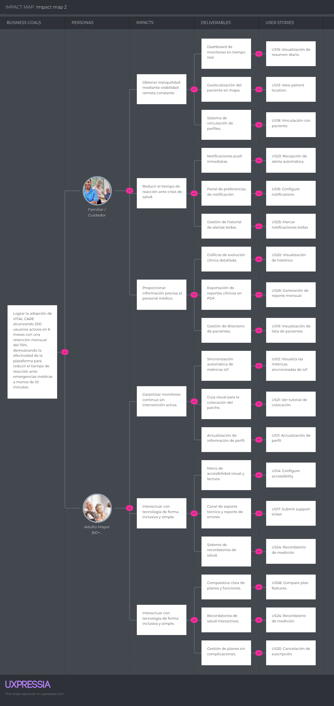

# Capítulo III: Requirements Specification

## 3.1. User Stories

| Epic / Story ID | Título | Descripción | Criterios de Aceptación                                                                                                                                                                                                              | Relacionado con (Epic ID) |
|-----------|-------|-----------|--------------------------------------------------------------------------------------------------------------------------------------------------------------------------------------------------------------------------------------|---------------------------|
| US01      | View service benefits | As a Visitor, I want to view the benefits of Vital Care so that I can understand how it helps with health monitoring. | Given a visitor enters the platform, when they request the main information, then the system displays the key benefits of the service.                                                                                               | EP01                      |
| US02      | View subscription plans | As a Visitor, I want to see the available subscription plans so that I can evaluate service costs. | Given a visitor checks pricing, when the system processes the request, then it displays available plans with their features and prices.                                                                                              | EP01                      |
| US03      | View problem statement | As a Visitor, I want to view the home care problem statement so that I can identify with the need for the service. | Given that a visitor explores the general information, When they reach the service context section, Then the system presents the main challenges of continuous home care in a structured way.                                        | EP01                      |
| US04      | Learn about the Startup | As a Visitor, I want to read ByteCore's mission and vision so that I can understand the purpose behind the platform. | Given that a visitor looks for information about the company, When they check the corporate section, Then the system displays the formal mission and vision statement of the organization.                                           | EP01                      |
| US05      | Consult legal terms | As a Visitor, I want to access the Terms of Service and Privacy Policies so that I can know how my medical data will be handled. | Given that a visitor navigates the platform, When they select the legal information links, Then the system presents the detailed documents on data protection and terms of use.                                                      | EP01                      |
| US06      | Patient registration | As a Visitor, I want to register as a patient so that I can access monitoring tools. | Given a visitor enters valid personal data, when they confirm registration, then the system creates a patient account and sends a confirmation email.                                                                                | EP02                      |
| US07      | Identify role-specific benefits | As a Visitor, I want to distinguish the benefits for both caregivers and patients so that I can understand how Vital Care helps each one.| Given that a visitor is in the "Designed for you" section, When they review the benefit cards, Then the system displays specific advantages for the Caregiver (e.g., "Reduce anguish") and the Patient (e.g., "Independent living"). | EP01                      |
| US08      | Compare plan features | As a Visitor, I want to see a detailed comparison between the Basic and Premium plans so that I can choose the one that best fits my needs.| Given that a visitor navigates to the "Planes" section, When they compare the options, Then the system clearly lists Premium-only features such as "Full vital signs history," "Advanced alerts," and "Weather data integration."| EP01                      |
| US09      | Login | As a User, I want to log into the platform so that I can access my private data. | Given a user enters valid credentials, when they request access, then the system grants access to the dashboard.                                                                                                                     | EP02                      |
| US10      | Password recovery | As a User, I want to recover my password so that I can regain access if I forget it. | Given a user requests recovery with a registered email, when the system processes it, then it sends a secure reset link.                                                                                                             | EP02                      |
| US11      | Update profile | As a User, I want to update my personal information so that my contact data stays current. | Given an authenticated user updates data, when they save changes, then the system updates the record successfully.                                                                                                                   | EP02                      |
| US12      | View IoT synced metrics | As a User, I want to view the real-time health metrics synchronized automatically from the IoT patch so that I don't have to enter them manually. | Given that the user has linked a valid patch, When they access the patient dashboard, Then the system displays the latest metrics (glucose, heart rate, oxygen, etc.) automatically.                                                 | EP03                      |
| US13      | View patient location | As a Caregiver, I want to view the patient's real-time GPS location on a map so that I can know exactly where they are in case of an anomaly. | Given that the user navigates to the patient list, When they click on "Ver Ubicación", Then the system displays a map centered on the patient's current coordinates.                                                                 | EP03                      |
| US14      | Configure accessibility | As a User, I want to configure the language, font size, and background color so that I can adapt the platform to my visual needs. | Given that the user opens the accessibility menu, When they select a new font size or language, Then the system immediately applies the changes to the entire interface.                                                             | EP02                      |
| US15      | Daily summary view | As a Patient, I want to view a daily summary so that I know if I'm stable. | Given a request is made, when processed, then the system shows last 24h records.                                                                                                                                                     | EP03                      |
| US16      | Configure notifications | As a User, I want to toggle email and push notifications on or off so that I can choose how I receive medical alerts. | Given that the user is in the notifications view, When they toggle the "Enviar a email" or "Push" switches, Then the system saves these preferences for future alerts.                                                               | EP05                      |
| US17      | Submit support ticket | As a User, I want to submit a support form if I have an issue with the app so that the technical team can help me. | Given that the user is in the Help & Support section, When they fill out the topic and description and click "Enviar", Then the system registers the ticket and confirms reception.                                                  | EP02                      |
| US18      | Link patient | As a Doctor, I want to link a patient so that I can monitor them. | Given a code is entered and approved, then the system creates the doctor-patient relationship.                                                                                                                                       | EP04                      |
| US19      | View patient list | As a Doctor, I want to see my patients so that I can manage workload. | Given request is made, then system lists linked patients.                                                                                                                                                                            | EP04                      |
| US20      | View patient history | As a Doctor, I want to view vital trends so that I can assess progress. | Given a patient is selected, then graphs for last 30 days are shown.                                                                                                                                                                 | EP04                      |
| US21      | View placement tutorial | As a User, I want to see a visual guide on how to place and link the patch so that I can configure the device correctly. | Given that the user accesses the "Colocación" section, When the view loads, Then the system displays step-by-step images and instructions for attaching the patch to the skin.                                                       | EP03                      |
| US22      | Remove patient | As a Doctor, I want to unlink patients so that I can manage active cases. | Given removal is confirmed, then system deletes relationship without data loss.                                                                                                                                                      | EP04                      |
| US23      | Automatic alert | As a Doctor, I want alerts for abnormal metrics so that I can act quickly. | Given abnormal value detected, then system sends high-priority notification.                                                                                                                                                         | EP05                      |
| US24      | Measurement reminder | As a Patient, I want reminders so that I maintain routine. | Given scheduled time, then notification is sent.                                                                                                                                                                                     | EP05                      |
| US25      | Mark notifications read | As a User, I want to mark alerts as read so that I stay organized. | Given confirmation, then status updates to read.                                                                                                                                                                                     | EP05                      |
| US26      | Monthly report PDF | As a Patient, I want to export my history so that I can share it. | Given request, then system generates PDF.                                                                                                                                                                                            | EP06                      |
| US27      | Patient report | As a Doctor, I want consolidated alerts so that I can analyze cases. | Given request, then system generates report.                                                                                                                                                                                         | EP06                      |
| US28      | Subscription plan selection | As a Patient, I want premium access so that I get full features. | Given payment method is valid, then system activates premium.                                                                                                                                                                        | EP07                      |
| US29      | Update payment method | As a Patient, I want to update my card so that service is uninterrupted. | Given validation, then system updates method.                                                                                                                                                                                        | EP07                      |
| US30      | Cancel subscription | As a Patient, I want to cancel my plan so that I stop service. | Given confirmation, then system schedules cancellation.                                                                                                                                                                              | EP07                      |
| US31      | User registration service | As a Developer, I want a service to create users so that data is stored. | Given valid data, then system saves and confirms.                                                                                                                                                                                    | EP08                      |
| US32      | Authentication service | As a Developer, I want authentication so that users are validated. | Given valid credentials, then system issues secure token.                                                                                                                                                                            | EP08                      |
| US33      | Metrics service | As a Developer, I want to store vital signs so that history is tracked. | Given valid data, then system stores it.                                                                                                                                                                                             | EP08                      |
| US34      | Metrics retrieval service | As a Developer, I want to fetch history so that UI can display it. | Given authorized request, then system returns data.                                                                                                                                                                                  | EP08                      |
| US35      | Linking service | As a Developer, I want to link users so that relationships exist. | Given approval, then system links records.                                                                                                                                                                                           | EP08                      |
| US36      | Patient listing service | As a Developer, I want listing service so that doctors see patients. | Given request, then system returns list.                                                                                                                                                                                             | EP08                      |
| US37      | Alert service | As a Developer, I want alert engine so that emergencies are handled. | Given abnormal event, then system logs and notifies.                                                                                                                                                                                 | EP08                      |
| US38      | Profile update service | As a Developer, I want update functionality so that data stays current. | Given valid update, then system saves changes.                                                                                                                                                                                       | EP08                      |
| US39      | Subscription service | As a Developer, I want payment processing so that plans are activated. | Given payment approved, then system upgrades account.                                                                                                                                                                                | EP08                      |
| US40      | PDF report service | As a Developer, I want report generation so that documents are created. | Given request, then system generates PDF.                                                                                                                                                                                            | EP08                      |
---
| Epic ID | Epic Name | Description |
|---------|------------|-------------|
| EP01 | Landing Page & Information | Public website management to present benefits, testimonials, plans, and user acquisition. |
| EP02 | User Management & Authentication | Registration, login, credential recovery, and profile management. |
| EP03 | Health Monitoring | Tools for recording and viewing vital signs and SOS alerts. |
| EP04 | Medical Management | Doctor features: patient linking, history review, and clinical notes. |
| EP05 | Notifications & Alerts | Messaging system for reminders and critical alerts. |
| EP06 | Reports & Export | Generation of exportable clinical reports (PDF). |
| EP07 | Subscriptions & Payments | Management of plans, billing, and cancellations. |
| EP08 | RESTful API Architecture | Backend services and endpoints for secure platform operations. |
## 3.2. Impact Mapping

## 3.3. Product Backlog

| Epic ID | Story ID | Title | Description | Priority | Story Points (1 / 2 / 3 / 5 / 8) |
|---------|----------|-------|-------------|----------|-------------------|
| **EP01** | **US01** | View service benefits | As a Visitor, I want to view the benefits of Vital Care so that I can understand how it helps with health monitoring. | Alta | 2 |
| **EP01** | **US02** | View subscription plans | As a Visitor, I want to see the available subscription plans so that I can evaluate service costs. | Alta | 2 |
| **EP01** | **US03** | View problem statement | As a Visitor, I want to view the home care problem statement so that I can identify with the need for the service. | Media | 1 |
| **EP01** | **US04** | Learn about the Startup | As a Visitor, I want to read ByteCore's mission and vision so that I can understand the purpose behind the platform. | Baja | 1 |
| **EP01** | **US05** | Consult legal terms | As a Visitor, I want to access the Terms of Service and Privacy Policies so that I can know how my medical data will be handled. | Baja | 1 |
| **EP01** | **US07** | Identify role-specific benefits | As a Visitor, I want to distinguish the benefits for both caregivers and patients so that I can understand how Vital Care helps each one. | Media | 2 |
| **EP01** | **US08** | Compare plan features | As a Visitor, I want to see a detailed comparison between the Basic and Premium plans so that I can choose the one that best fits my needs. | Media | 2 |
| **EP02** | **US06** | Patient registration | As a Visitor, I want to register as a patient so that I can access monitoring tools. | Alta | 3 |
| **EP02** | **US09** | Login | As a User, I want to log into the platform so that I can access my private data. | Alta | 3 |
| **EP02** | **US10** | Password recovery | As a User, I want to recover my password so that I can regain access if I forget it. | Media | 3 |
| **EP02** | **US11** | Update profile | As a User, I want to update my personal information so that my contact data stays current. | Media | 2 |
| **EP02** | **US14** | Configure accessibility | As a User, I want to configure the language, font size, and background color so that I can adapt the platform to my visual needs. | Media | 3 |
| **EP02** | **US17** | Submit support ticket | As a User, I want to submit a support form if I have an issue with the app so that the technical team can help me. | Baja | 2 |
| **EP03** | **US12** | View IoT synced metrics | As a User, I want to view the real-time health metrics synchronized automatically from the IoT patch so that I don't have to enter them manually. | Alta | 8 |
| **EP03** | **US13** | View patient location | As a Caregiver, I want to view the patient's real-time GPS location on a map so that I can know exactly where they are in case of an anomaly. | Alta | 5 |
| **EP03** | **US15** | Daily summary view | As a Patient, I want to view a daily summary so that I know if I'm stable. | Alta | 3 |
| **EP03** | **US21** | View placement tutorial | As a User, I want to see a visual guide on how to place and link the patch so that I can configure the device correctly. | Media | 2 |
| **EP04** | **US18** | Link patient | As a Doctor, I want to link a patient so that I can monitor them. | Alta | 5 |
| **EP04** | **US19** | View patient list | As a Doctor, I want to see my patients so that I can manage workload. | Alta | 3 |
| **EP04** | **US20** | View patient history | As a Doctor, I want to view vital trends so that I can assess progress. | Media | 5 |
| **EP04** | **US22** | Remove patient | As a Doctor, I want to unlink patients so that I can manage active cases. | Baja | 2 |
| **EP05** | **US16** | Configure notifications | As a User, I want to toggle email and push notifications on or off so that I can choose how I receive medical alerts. | Media | 3 |
| **EP05** | **US23** | Automatic alert | As a Doctor, I want alerts for abnormal metrics so that I can act quickly. | Alta | 8 |
| **EP05** | **US24** | Measurement reminder | As a Patient, I want reminders so that I maintain routine. | Media | 3 |
| **EP05** | **US25** | Mark notifications read | As a User, I want to mark alerts as read so that I stay organized. | Baja | 2 |
| **EP06** | **US26** | Monthly report PDF | As a Patient, I want to export my history so that I can share it. | Media | 5 |
| **EP06** | **US27** | Patient report | As a Doctor, I want consolidated alerts so that I can analyze cases. | Media | 5 |
| **EP07** | **US28** | Subscription plan selection | As a Patient, I want premium access so that I get full features. | Alta | 5 |
| **EP07** | **US29** | Update payment method | As a Patient, I want to update my card so that service is uninterrupted. | Media | 3 |
| **EP07** | **US30** | Cancel subscription | As a Patient, I want to cancel my plan so that I stop service. | Baja | 2 |
| **EP08** | **US31** | User registration service | As a Developer, I want a service to create users so that data is stored. | Alta | 5 |
| **EP08** | **US32** | Authentication service | As a Developer, I want authentication so that users are validated. | Alta | 5 |
| **EP08** | **US33** | Metrics service | As a Developer, I want to store vital signs so that history is tracked. | Alta | 8 |
| **EP08** | **US34** | Metrics retrieval service | As a Developer, I want to fetch history so that UI can display it. | Alta | 5 |
| **EP08** | **US35** | Linking service | As a Developer, I want to link users so that relationships exist. | Alta | 5 |
| **EP08** | **US36** | Patient listing service | As a Developer, I want listing service so that doctors see patients. | Media | 3 |
| **EP08** | **US37** | Alert service | As a Developer, I want alert engine so that emergencies are handled. | Alta | 8 |
| **EP08** | **US38** | Profile update service | As a Developer, I want update functionality so that data stays current. | Media | 3 |
| **EP08** | **US39** | Subscription service | As a Developer, I want payment processing so that plans are activated. | Alta | 5 |
| **EP08** | **US40** | PDF report service | As a Developer, I want report generation so that documents are created. | Media | 5 |