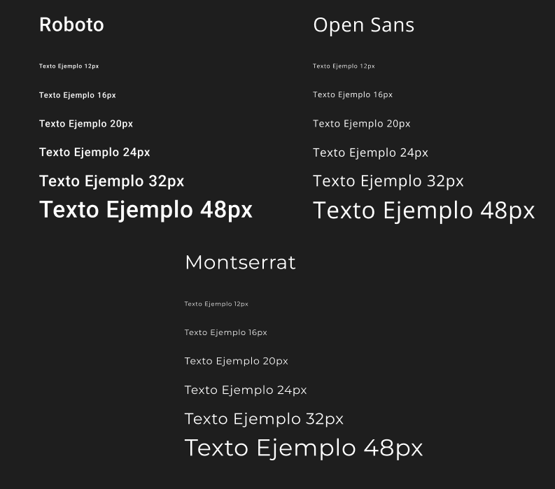
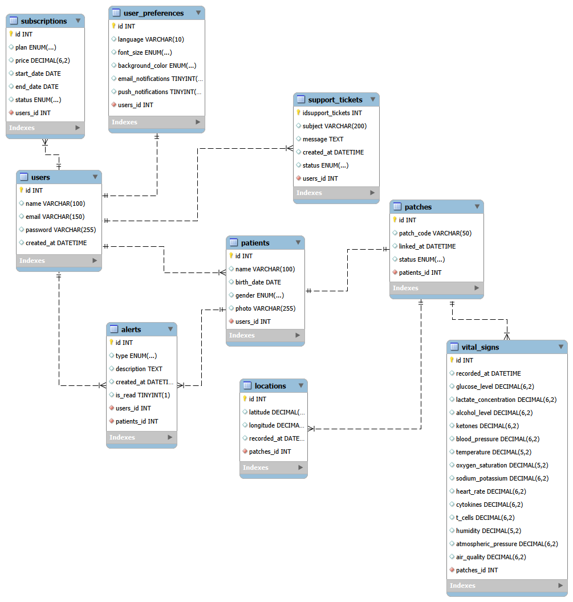

# Capítulo IV: Product Design

## 4.1. Style Guidelines

### 4.1.1. General Style Guidelines
### Brand Overview
Bytecore es una startup enfocada en el desarrollo de soluciones digitales orientadas al sector de la salud. El producto principal, VITALCARE, es una plataforma de monitoreo remoto de signos vitales mediante un parche que se encarga del seguimiento en tiempo real de pacientes con enfermedades crónicas y adultos mayores. El diseño debe transmitir seguridad, confianza y accesibilidad, dado que está dirigido tanto a familiares que se encargan del cuidado como a adultos mayores que no podrían estar familiarizados con la tecnología.
### Brand Name
El nombre "VITALCARE" refleja directamente el propósito de la plataforma: el cuidado ("Care") continuo de los signos vitales ("Vital") de los pacientes, fusionando la eficiencia de la tecnología con la cercanía del cuidado familiar.
### Colors

| Hex Code | Uso                                                        |
|----------|------------------------------------------------------------|
| #0C7AB5  | Color Principal                                            |
| #F0F4F8  | Color de Fondo                                             |
| #FFFFFF  | Color de Contenedores                                      |
| #38A169  | Color de botones para confirmar                            |
| #CA4B4B  | Color de botones para cancelar                             |
| #2D3748  | Color de letra para los pacientes en la tabla de pacientes |
| #666666  | Color secundario de letra                                  |
| #000000  | Color terciario de letra                                   |

### Typography
Para la tipografía de VITALCARE se ha elegido fuentes que transmiten profesionalismo, claridad y accesibilidad: Se utilizó la fuente Roboto para los titulos, encabezados y cuerpo, ya que transmite modernidad y es fácil de leer, lo que es crucial para una plataforma de salud. Para los botones se utilizó la fuente Open Sans, que es amigable y legible, lo que ayuda a mejorar la experiencia del usuario al interactuar con la plataforma y para los datos de analisis se utilizó la fuente Montserrat, que es una fuente sans-serif moderna y elegante, que aporta un toque de sofisticación a la presentación de los datos, haciendo que la información sea más atractiva y fácil de interpretar para los usuarios.

### 4.1.2. Web Style Guidelines
Se han establecido las siguientes pautas de estilo para el diseño web de VITALCARE, con el objetivo de garantizar una experiencia de usuario coherente, accesible y atractiva:

Además, contará con un diseño web responsivo, en la cual se podrá adaptar sin problemas a cualquier dispositivo, desde dispositivos moviles hasta monitores de escritorio. Enfocandose en ofrecer una experiencia de usuario intuitiva y consistente, permitiendo a los usuarios desplazarse facilmente por la plataforma.

Se implementó para la interfaz de usuario el patron Z para poder guiar la mirada del usuario desde el logo, pasando por el menú de navegación, luego a la imagen principal y finalmente a los botones de acción, asegurando que los elementos más importantes sean vistos en el orden correcto. Además, se implementó el patrón F para la sección de análisis de datos, permitiendo a los usuarios escanear rápidamente la información más relevante, como los títulos y los datos clave, facilitando la comprensión y la toma de decisiones informadas.

---

## 4.2. Information Architecture

### 4.2.1. Organization Systems
Se implementó tres esquemas de organización que permiten la escalabilidad del sistema y la toma rapida de desiciones, las cuales son:

- Hierarchical Organization: Se utliza una estructura de "Top-Down". En el cual el nivel superior está el dashboard, seguido por la lista de pacientes y finalmente los signos vitales de los pacientes. Esta jerarquia permite que el usuario tenga una visión general del estado de todos los pacientes que registro antes de especificar en las metricas de cada uno.

- Organization by Task: La plataforma separa las funciones administrativas, como el gestor de perfil, plan de suscripción, etc. de las funciones operativas monitoreo en tiempo real, historial de notificaciones, entre otros. Para evitar que el usuario se distraiga con opciones de configuración mientras monitorea a sus pacientes.

- Visual organization: Se aplica el principio de contraste y tamaño para los datos como la frecuencia cardiaca o presión arterial utilizando colores semánticos (Rojo/Amarillo/Verde) para que el estado de salud sea comprensible en el menor tiempo de visualización.

Esta organización garantiza que en una emergencia, el usuario no pierda tiempo navegando por la plataforma. Las estructuras jerárquicas ya mencionadas aseguran que el camino hacia la información fundamental siempre sea el más corto posible.
### 4.2.2. Labeling Systems
Para el sistema de etiquetado se optó por utilizar etiquetas claras y consistentes, eliminando tecnicismos medicos complejos por términos de lenguaje más naturales que cualquier usuario pueda entender.

- Navigations Labels: Se ha seleccionado terminos literales para el menú principal de navegación: "Home", "Paciente", "Planes", "Soporte".

- Action Labels: Las etiquetas de los botones son bastaste claros indicar el resultado de la acción definida: "Empieza a monitorear ahora", "Ver status", "Descargar reporte".

- Iconography Labels: Se utilizan la libreria de iconos PrimeNG con una covención estandarizada:
    - Mapa/Pin: Ubicación GPS del paciente
    - Signos: Actualización de las métricas de salud del paciente.
    - Alerta: Métricas de salud del paciente irregular o que requieren atención inmediata.
    - Flecha hacia arriba: Métricas de salud del paciente elevadas.
    - Flecha hacia abajo: Métricas de salud del paciente bajas.
    - Campana: Notificaciones del sistema, como recordatorios de medicación o alertas de salud.
    - Accesibilidad: Icono de accesibilidad para configurar opciones de visualización adaptadas a usuarios con discapacidades visuales.
  
Utilizando este etiquetado consistente, se garantiza reducir la curva de aprendizaje para los usuarios, al utilizar iconos y términos familiares, minimizando la posibilidad de cometer errores, lo cual es vital en una aplicación orientada a la salud.

### 4.2.3. SEO Tags and Meta Tags
Aunque VITALCARE sea una plataforma de monitoreo remoto, la Landing Page es crucial para el apartado de marketing y la adquisición de los clientes. Se aplicarán los siguientes tags en la página de incio para poder optimizar su visibilidad en motores de búsqueda y mejorar su posicionamiento.

- Title: "VITALCARE | Monitoreo Remoto de Signos Vitales y Salud Iot"

- Meta Description: "Protege a quienes más quieres con VITAL CARE. Monitoreo de signos vitales en tiempo real para adultos mayores mediante parches IoT. Seguridad y tranquilidad en un solo clic."

- Meta Keywords: "monitoreo remoto, signos vitales, salud IoT, cuidado de adultos mayores, parches de salud, seguridad en el hogar, tecnología para la salud, bienestar digital"

- Meta Author: "ByteCore Team"
### 4.2.4. Searching Systems
El sistema de búsqueda de VITAL CARE está diseñado para la gestión eficiente de múltiples pacientes (especialmente para usuarios del Plan Premium).

- Search Bar Centralizado: Ubicado en el Dashboard de Pacientes. Permite búsquedas por Nombre, Apellido o DNI.

- Filtering (Filtros Avanzados): Los usuarios pueden filtrar su lista de pacientes por:

- Estado de Salud: Filtrar solo aquellos que tienen una "Alerta Crítica".

- Estado de Conexión: Filtrar pacientes cuyo parche tenga "Baja Batería" o esté "Desconectado".

- Predictive Search: A medida que el usuario escribe, el sistema sugiere nombres de pacientes para acelerar el acceso a los datos biométricos.

A medida que la base de pacientes crece, la búsqueda manual se vuelve ineficiente. Los filtros de estado permiten al cuidador priorizar su atención en aquellos pacientes que realmente presentan anomalías en sus signos vitales.
### 4.2.5. Navigation Systems
Se han implementado sistemas de navegación complementarios para asegurar que el usuario no se pierda dentro de la aplicación.

- Global Navigation: Un menú superior (Header) persistente que contiene el logo (enlace al Home), acceso al perfil y el centro de notificaciones.

- Local Navigation: Dentro de la vista de un paciente, existe una barra lateral o "Tabs" que permiten alternar entre: Métricas en Vivo, Historial Gráfico, Ubicación GPS e Información de Contacto Médico.

- Contextual Navigation: En cada sección, se incluyen botones de acción relacionados, como "Volver a la lista de pacientes", "Descargar reporte PDF" o "Configurar alertas personalizadas".

La navegación múltiple (Global, Local y Contextual) garantiza la "Findability" de las funciones. El uso de la local navigation y la navegación contextual reduce la ansiedad del usuario al navegar por datos médicos complejos, ofreciendo siempre una salida o una acción lógica siguiente.

---

## 4.3. Landing Page UI Design

### 4.3.1. Landing Page Wireframe
El Wireframe de baja fidelidad se estructuró para establecer una jerarquía de información clara antes de la aplicación de elementos visuales. Se utilizó una disposición de "Single Page Scroll" para permitir una narrativa continua.

### 4.3.2. Landing Page Mock-up
El Mock-up de alta fidelidad (basado en el diseño final) aplica la paleta de colores corporativa y tipografías seleccionadas para transmitir una imagen de "Salud Tecnológica".

---

## 4.4. Web Applications UX/UI Design

### 4.4.1. Web Applications Wireframes
Los wireframes de baja fidelidad para la aplicación web se diseñaron para establecer la estructura y funcionalidad básica de las principales vistas: Dashboard, Vista del Paciente, Configuración y Notificaciones.

### 4.4.2. Web Applications Wireflow Diagrams

### 4.4.3. Web Applications Mock-ups

### 4.4.4. Web Applications User Flow Diagrams
User Goal 1: Como usuario, quiero poder restablecer mi contraseña para recuperar el acceso a mi cuenta en caso de olvido.

User Goal 2: Como usuario, quiero poder agregar un nuevo paciente a mi lista para monitorear sus signos vitales.

User Goal 3: Como usuario, quiero poder configurar mis notificaciones para recibir alertas personalizadas sobre el estado de salud de mis pacientes.

User Goal 4: Como usuario, quiero poder visualizar la ubicación GPS de mis pacientes para asegurarme de que estén en un lugar seguro.

User Goal 5: Como usuario, quiero poder acceder a un historial gráfico de los signos vitales de mis pacientes para analizar su evolución a lo largo del tiempo.

---

## 4.5. Web Applications Prototyping

---

## 4.6. Domain-Driven Software Architecture

### 4.6.1. Design-Level EventStorming

### 4.6.2. Software Architecture Context Diagram

### 4.6.3. Software Architecture Container Diagrams

### 4.6.4. Software Architecture Components Diagrams

---

## 4.7. Software Object-Oriented Design

### 4.7.1. Class Diagrams

---

## 4.8. Database Design

### 4.8.1. Database Diagrams

