# Capítulo V: Product Implementation, Validation & Deployment

## 5.1. Software Configuration Management

### 5.1.1. Software Development Environment Configuration

A continuación, se describen los productos de software empleados en el desarrollo del proyecto. Esta sección tiene como objetivo facilitar la comprensión y continuidad
del trabajo a los actuales y futuros desarrolladores, asegurando una colaboración efectiva a lo largo del ciclo de vida del producto digital.

**Project Management**
- Trello – https://trello.com/ 
  Se ha utilizado Trello como herramienta principal de gestión de tareas. Esta plataforma permite visualizar el progreso de cada etapa del proyecto mediante
  tableros personalizables, facilitando la organización de pendientes, tareas en desarrollo y actividades finalizadas. Además, su interfaz intuitiva y accesibilidad
  desde cualquier navegador con una cuenta registrada la convierten en una solución ágil para el seguimiento de proyectos en equipo.

**Requirements Management**
- Google Docs – https://docs.google.com/ 
  Para la redacción, gestión y revisión de los requisitos del sistema se ha empleado Google Docs. Su funcionalidad de edición colaborativa en tiempo real ha
  permitido que todos los integrantes del equipo puedan aportar, comentar y revisar los documentos desde cualquier dispositivo.

**Product UX/UI Design**
- Figma – https://www.figma.com/ 
  Figma ha sido fundamental para el diseño de interfaces y la creación de prototipos interactivos. Permite que varios usuarios trabajen simultáneamente en los
  wireframes y mockups, lo que ha facilitado una comunicación más eficiente entre el equipo de diseño y desarrollo.
- Miro https://miro.com/es/ 
  Pizarra digital colaborativa utilizada para sesiones de Big Picture EventStorming y Design-Level EventStorming, facilitando la identificación de Bounded Contexts, Events, Commands y Aggregates del dominio.
- LucidChart https://www.lucidchart.com/pages/es  
  Aplicación de diagramación colaborativa para la creación de Wireflows, User Flows, diagramas UML (Class Diagrams) y Database Diagrams de la arquitectura del software.

**Software Development**
- Landing Page y Frontend (HTML, CSS, JS) – https://www.jetbrains.com/webstorm/ 
  Desarrollada con HTML5, CSS3 y JavaScript. El entorno de desarrollo fue IntelliJ Webstorm por sus herramientas avanzadas de depuración y control de versiones.
  Web Services (Spring Boot) – https://www.jetbrains.com/idea/
  Desarrollado en Spring Boot Framework con el lenguaje de programación Java , usando IntelliJ IDEA como entorno de desarrollo. Se requiere el Java Development Kit (JDK) versión 17 o superior (o la versión indicada por el docente) disponible en https://www.oracle.com/java/technologies/downloads/.

**Software Documentation**
- Google Docs y GitHub README  
  La documentación del software se ha centralizado en Google Docs. El archivo README en GitHub incluye instrucciones de despliegue, estructura del repositorio y
  requerimientos técnicos.
- Markdown https://www.markdownguide.org/  
  Lenguaje de marcado ligero para la elaboración del Project Report en el repositorio GitHub. Permite estructurar documentación con formato consistente y compatible con control de versiones.

## Deployment & Hosting

### **GitHub Pages**
**Descripción**:
Es un servicio de alojamiento de sitios estáticos que procesa archivos HTML, CSS y JavaScript directamente desde un repositorio en GitHub para la publicación de aplicaciones web.

**Uso**:
Se utiliza para el despliegue de la **Landing Page** y la aplicación frontend desarrollada con el framework **Angular**. El proceso se integra con el flujo de trabajo de Git, donde la rama de producción (`main` o `gh-pages`) se sincroniza automáticamente para actualizar el sitio. Esto permite una distribución eficiente de la interfaz de usuario, garantizando que los cambios en el código se reflejen de manera inmediata en el entorno de producción bajo un protocolo seguro HTTPS.

**Descripción**:
Plataformas PaaS (Platform as a Service) diseñadas para el despliegue de aplicaciones robustas del lado del servidor, con soporte nativo para entornos de ejecución como Java.

**Uso**:
Se emplea para el despliegue de los **Web Services** desarrollados con **Spring Boot**. A diferencia de los sitios estáticos, estas plataformas permiten la ejecución del Java Development Kit (JDK) y la conectividad con sistemas de gestión de bases de datos relacionales, asegurando que la API RESTful esté disponible de manera persistente para ser consumida por el frontend alojado en GitHub Pages.

### 5.1.2. Source Code Management

Para el seguimiento y control de modificaciones en el código fuente, el equipo utiliza **GitHub** como plataforma principal, organizada bajo la organización oficial **1ASI0729-2610-10177-ByteCore-VitalCare**.

Se aplica **GitFlow** como flujo de trabajo (*workflow*) de control de versiones, **Conventional Commits** para la estandarización de los mensajes de confirmación y **Semantic Versioning** para la gestión de versiones y lanzamientos (*releases*).

A continuación, se detallan los repositorios que conforman la solución técnica de **VitalCare**:

| Producto | Repositorio |
| :--- | :--- |
| **Project Report** | [https://github.com/1ASI0729-2610-10177-ByteCore-VitalCare/VitalCare-Proyect-Report.git](https://github.com/1ASI0729-2610-10177-ByteCore-VitalCare/VitalCare-Proyect-Report.git) |
| **Landing Page** | [https://github.com/1ASI0729-2610-10177-ByteCore-VitalCare/VitalCare-Landing-Page.git](https://github.com/1ASI0729-2610-10177-ByteCore-VitalCare/VitalCare-Landing-Page.git) |
| **Frontend Web Application** | [https://github.com/1ASI0729-2610-10177-ByteCore-VitalCare/VitalCare-Frontend.git](https://github.com/1ASI0729-2610-10177-ByteCore-VitalCare/VitalCare-Frontend.git) |
| **Web Services** | [https://github.com/1ASI0729-2610-10177-ByteCore-VitalCare/VitalCare-Backend.git](https://github.com/1ASI0729-2610-10177-ByteCore-VitalCare/VitalCare-Backend.git) |

#### **GitFlow Workflow**
El equipo implementa GitFlow para organizar el desarrollo. Las ramas se clasifican de la siguiente manera:

* **Ramas principales:**
    * `main`: Contiene el código fuente en un estado estable y listo para producción. Solo se actualiza mediante fusiones (*merges*) de ramas de *release*.
    * `develop`: Rama de integración donde se consolidan las funcionalidades terminadas antes de pasar a producción.
* **Ramas de soporte:**
    * `feature/<nombre>`: Ramas temporales creadas desde `develop` para el desarrollo de funcionalidades específicas o secciones del informe (ej. `feature/chapter-1`). Al finalizar, se fusionan de vuelta a `develop`.
    * `release/<version>`: Ramas de preparación para un lanzamiento oficial, permitiendo realizar ajustes finales y pruebas de integración antes de fusionar a `main`.

#### **Conventional Commits**
Los mensajes de confirmación (*commit*) siguen la estructura: `<type>(scope): description`. Los tipos permitidos incluyen `feat` (funcionalidad), `fix` (corrección), `docs` (documentación), `style` (formato), `refactor` (mejora de código) y `chore` (mantenimiento).

### 5.1.3. Source Code Style Guide & Conventions

En este apartado se definen los estándares de codificación y nomenclatura adoptados por el equipo para garantizar la mantenibilidad y legibilidad del código de **VITAL CARE**. Se aplican las siguientes convenciones basadas en las guías de estilo de Google:

- **Language Standards**: Todo el código fuente, incluyendo nombres de variables, funciones, clases, IDs de CSS y comentarios, se redacta exclusivamente en idioma **inglés** para mantener un estándar profesional global.

- **Naming Conventions**:
    - **Backend (Java / Spring Boot)**: Se utiliza `PascalCase` para nombres de clases y `camelCase` para métodos, variables locales y parámetros (ej. `VitalSignController`, `getPatientById`). Se sigue la Google Java Style Guide.
    - **Frontend (HTML/CSS)**: Se utiliza `kebab-case` para nombres de archivos de estilo y para clases e IDs en las hojas de estilo (ej. `.patient-card`, `.alert-banner`). Se siguen las guías Google HTML/CSS Style Guide y HTML Style Guide and Coding Conventions de W3Schools.
    - **TypeScript / Angular**: Se aplica `camelCase` para variables y funciones, y `PascalCase` para componentes y servicios (ej. `PatientListComponent`, `AlertService`). Se siguen la Angular coding style guide y la Google TypeScript Style Guide.

- **Source Control Conventions**: Se aplica el estándar de **Conventional Commits**, utilizando prefijos descriptivos en inglés como `feat:`, `fix:`, `docs:`, `style:`, `refactor:` y `chore:` para asegurar un historial de versiones estructurado y rastreable.

- **Code Formatting**: Se mantiene una indentación consistente de 2 espacios en archivos HTML, CSS y TypeScript siguiendo las convenciones de Angular. En el desarrollo backend con Java se sigue el formato automático de IntelliJ IDEA para mantener la limpieza y consistencia de los archivos de clase.

- **Gherkin**: Los criterios de aceptación de los User Stories se redactan siguiendo las convenciones de Gherkin Conventions for Readable Specifications para garantizar especificaciones legibles y comprobables.

### 5.1.4. Software Deployment Configuration

Esta sección detalla la configuración del despliegue de la solución, permitiendo que los productos digitales sean accesibles de forma continua en un entorno de producción.

- **Hosting & Cloud Platforms**:
    - **Landing Page**: Se ha desplegado satisfactoriamente en **GitHub Pages**, aprovechando su integración nativa con los repositorios de GitHub y su soporte para sitios estáticos bajo protocolo HTTPS.
    - **Frontend Web Application**: Se ha definido el despliegue en **GitHub Pages** mediante el build de producción generado por Angular (`ng build`), publicando el contenido de la carpeta `dist/` en la rama de producción.
    - **Web Services & API**: Para las fases posteriores del proyecto, se definirá el proveedor de despliegue para los servicios web desarrollados en Spring Boot, garantizando la disponibilidad persistente de la API RESTful para ser consumida por el frontend.
- **Continuous Deployment (CD) Pipeline**:
    - **Integración**: El repositorio oficial en GitHub (`VitalCare-Landing-Page`) está vinculado directamente a GitHub Pages como plataforma de despliegue.
    - **Branching Strategy**: La rama `main` actúa como la rama de producción oficial. Cualquier cambio integrado mediante *merge* o *push* en esta rama activa automáticamente un nuevo despliegue hacia la URL pública: [https://1asi0729-2610-10177-bytecore-vitalcare.github.io/VitalCare-Landing-Page/](https://1asi0729-2610-10177-bytecore-vitalcare.github.io/VitalCare-Landing-Page/)
- **Environment Configuration**:
    - **Estado Actual (Sprint 1)**: El despliegue actual no requiere el uso de variables de entorno ni claves de API externas, dado que corresponde al despliegue de la Landing Page como prototipo visual e informativo desarrollado con HTML5, CSS3 y JavaScript.
    - **Planificación Futura**: En los próximos Sprints, se configurarán variables de entorno para gestionar de forma segura las cadenas de conexión a la base de datos MySQL y los tokens de autenticación requeridos por los servicios IoT del dispositivo parche.

---

## 5.2. Landing Page, Services & Applications Implementation

### 5.2.1. Sprint 1

En este Sprint se desarrolló e implementó la primera versión
del Landing Page de VitalCare, incluyendo su despliegue
en un entorno accesible públicamente.

#### 5.2.1.1. Sprint Planning 1

A continuación se presenta el resumen del Sprint Planning Meeting
realizado para el Sprint 1.

| Sprint # | Sprint 1                                                                                                                                                                                                                                                                                                                                                      |
|----------|---------------------------------------------------------------------------------------------------------------------------------------------------------------------------------------------------------------------------------------------------------------------------------------------------------------------------------------------------------------|
| **Sprint Planning Background** |                                                                                                                                                                                                                                                                                                                                                               |
| Date | 2026-04-15                                                                                                                                                                                                                                                                                                                                                    |
| Time | 04:30 PM                                                                                                                                                                                                                                                                                                                                                      |
| Location | Reunión virtual vía Google Meet                                                                                                                                                                                                                                                                                                                               |
| Prepared By | Rioja Nuñez, Franco Diego                                                                                                                                                                                                                                                                                                                                     |
| Attendees | HBardales Tejada, Luis Alexis / Caisahuana Osores, Becker Junior / Huaman Gallardo, Bruno Aldair / Rioja Nuñez, Franco Diego / Rocca Mariaca, Angel Mathias                                                                                                                                                                                                   |
| **Sprint Goal & User Stories** |                                                                                                                                                                                                                                                                                                                                                               |
| Sprint 1 Goal | Our approach focuses on strengthening VitalCare's digital presence by launching its initial landing page. We believe this will effectively communicate our value proposition to family members and seniors. This will be validated once the site is published on GitHub Pages, integrating strategic sections and calls to action targeted to both audiences. |
| Sprint 1 Velocity | 20                                                                                                                                                                                                                                                                                                                                                            |
| Sum of Story Points | 17                                                                                                                                                                                                                                                                                                                                                            |

#### 5.2.1.2. Aspect Leaders and Collaborators

En esta sección se detalla la matriz de liderazgo y colaboración (LACX) para el Sprint 1. Cada aspecto representa una fase crítica de la entrega, donde se designa un líder (L) responsable de la dirección del entregable y colaboradores (C) que apoyaron en su ejecución, cumpliendo con el objetivo de proporcionar liderazgo conjunto y un entorno colaborativo (ABET Student Outcome 3).

| Team Member (Last Name, First Name) | GitHub Username | Idea de Negocio y Bases | Landing Page | Diseño de App Web (Figma) | User Stories y Funciones | Análisis de Usuario y Needfinding |
| :--- | :--- | :---: | :---: | :---: | :---: | :---: |
| Rioja Nuñez, Franco Diego | FrancoDiegoR | **L** | C | C | C | C |
| Rocca Mariaca, Angel Mathias | MRMpro13 | C | **L** | C | C | C |
| Huaman Gallardo, Bruno Aldair | BrunoHG10 | C | C | C | **L** | C |
| Caisahuana Osores, Becker Junior | becker693 | C | C | **L** | C | C |
| Bardales Tejada, Luis Alexis | AlexisBardales | C | C | C | C | **L** |

#### 5.2.1.3. Sprint Backlog 1

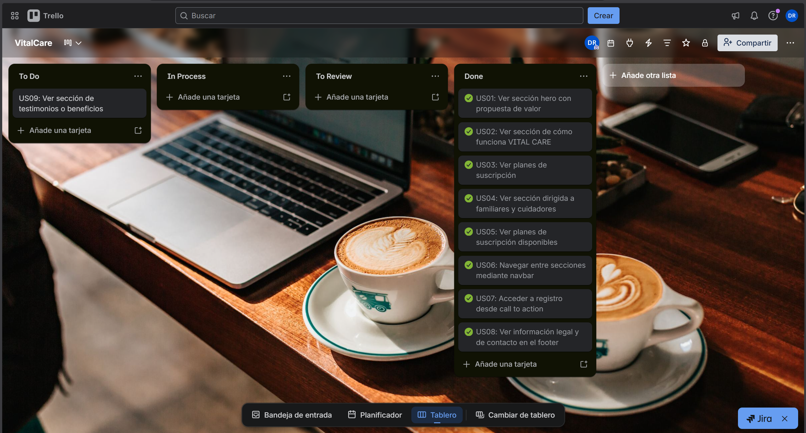

Enlace de Trello: https://trello.com/invite/b/69eab993248a35acb106f3a5/ATTId84e5c54d692b66f96b0986e5aa280133194A223/vitalcare

#### 5.2.1.4. Development Evidence for Sprint Review

Durante el Sprint 1, el equipo utilizó GitHub como sistema de control de versiones, siguiendo el flujo de trabajo GitFlow para asegurar una integración ordenada del código. A continuación, se presenta el registro de los commits más relevantes que evidencian el desarrollo de la Landing Page y la colaboración del equipo.

**Repository:** 1ASI0729-2610-10177-ByteCore-VitalCare/VitalCare-Landing-Page

| Repository | Branch | Commit Id | Commit Message | Commit Message Body | Committed on (Date) |
| :--- | :--- | :--- | :--- | :--- | :--- |
| `VitalCare-Landing-Page` | `main` | `7db1fbc` | `Delete .idea directory` | `Removed IDE configuration files from version control.` | 23/04/2026 |
| `VitalCare-Landing-Page` | `main` | `76a6b36` | `Merge pull request #2 from 1ASI0729-2610-10177-ByteCore-VitalCare/develop` | `Merged develop branch into main for Sprint 1 release.` | 23/04/2026 |
| `VitalCare-Landing-Page` | `develop` | `9b2ead9` | `feat(index): update title and add meta tags for SEO optimization` | `Updated page title and added description, keywords and author meta tags.` | 23/04/2026 |
| `VitalCare-Landing-Page` | `develop` | `bb8b0f0` | `feat(landing): Remove unused header, add animations, and fix image hero` | `Cleaned up unused elements, added scroll animations and fixed hero image rendering.` | 23/04/2026 |
| `VitalCare-Landing-Page` | `develop` | `416e484` | `feat(landing): add landing page structure and styles` | `Added full HTML structure and CSS styles for all landing page sections.` | 21/04/2026 |
| `VitalCare-Landing-Page` | `develop` | `be0110f` | `landing initial structure` | `Initial HTML and CSS structure for the landing page layout.` | 14/04/2026 |
| `VitalCare-Landing-Page` | `develop` | `4bd0d8b` | `Initial commit` | `Initial repository setup with base project files.` | 14/04/2026 |

#### 5.2.1.5. Execution Evidence for Sprint Review

En esta sección se presenta la evidencia de la ejecución del Sprint 1, demostrando el cumplimiento de los objetivos establecidos y el despliegue del producto en un entorno de producción accesible.

**Enlace del Landing Page:** [https://vitalcare.github.io/](https://1asi0729-2610-10177-bytecore-vitalcare.github.io/VitalCare-Landing-Page/)

**Evidencia de Despliegue (GitHub Pages):**

A continuación, se presenta la captura del dashboard de GitHub que confirma el despliegue exitoso (Production Deployment) de la Landing Page desde el repositorio oficial de GitHub.

#### 5.2.1.6. Services Documentation Evidence for Sprint Review

Para el presente Sprint 1, el alcance se centró exclusivamente en la implementación y despliegue del Landing Page (sitio web estático). Por lo tanto, no se han desarrollado servicios RESTful API en esta etapa. La documentación detallada de los endpoints mediante OpenAPI (Swagger) se incluirá en los informes correspondientes a los siguientes Sprints, una vez iniciada la fase de implementación de los Web Services.

#### 5.2.1.7. Software Deployment Evidence for Sprint Review

Durante el Sprint 1, se realizó el despliegue de la Landing Page de VITAL CARE
utilizando GitHub Pages como plataforma de hosting. A continuación se describen
las actividades realizadas para lograr la publicación exitosa del sitio.

1. Se creó el repositorio `VitalCare-Landing-Page` bajo la organización
   `1ASI0729-2610-10177-ByteCore-VitalCare` en GitHub.

2. Se desarrolló la Landing Page en la rama `develop` siguiendo el flujo
   GitFlow, integrando las secciones de hero, problemática, beneficios,
   startup, planes y footer.

3. Una vez validado el contenido, se realizó el merge de `develop` hacia
   `main` mediante Pull Request, lo que activó automáticamente el despliegue
   en GitHub Pages.

4. Se verificó el despliegue exitoso accediendo a la URL pública:
   [https://1asi0729-2610-10177-bytecore-vitalcare.github.io/VitalCare-Landing-Page/](https://1asi0729-2610-10177-bytecore-vitalcare.github.io/VitalCare-Landing-Page/)

#### 5.2.1.8. Team Collaboration Insights during Sprint

## Desarrollo del reporte

#### AV1:

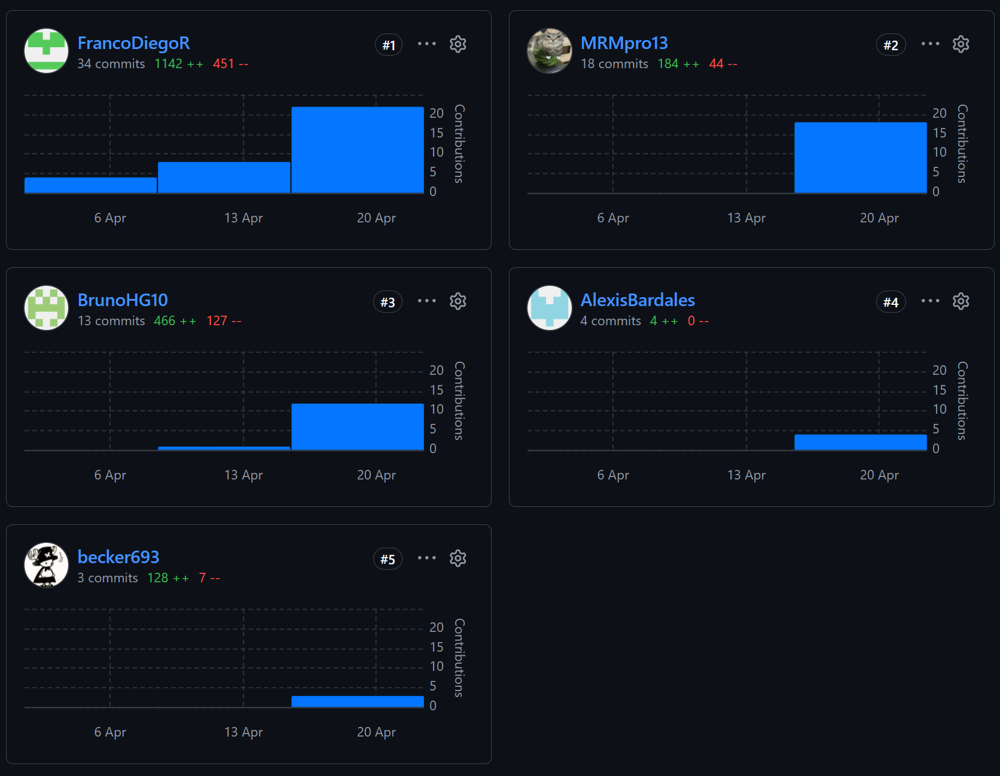

## Desarrollo de Landing Page
#### AV1:

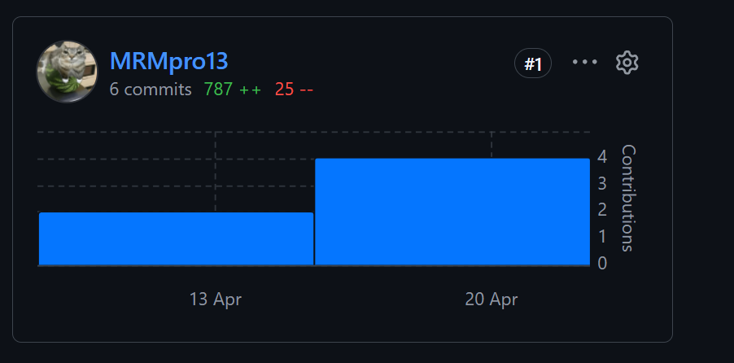

---
## 5.2.2. Sprint 2

#### 5.2.2.1. Sprint Planning 2

A continuación se presenta el resumen del Sprint Planning Meeting
realizado para el Sprint 2.

| Sprint #                           | Sprint 2                                                                                                                                                                                                                                                                                                |
|------------------------------------|---------------------------------------------------------------------------------------------------------------------------------------------------------------------------------------------------------------------------------------------------------------------------------------------------------|
| **Sprint Planning Background**     |                                                                                                                                                                                                                                                                                                         |
| Date                               | 2026-05-10                                                                                                                                                                                                                                                                                              |
| Time                               | 04:30 PM                                                                                                                                                                                                                                                                                                |
| Location                           | Reunión virtual vía Google Meet                                                                                                                                                                                                                                                                         |
| Prepared By                        | Rioja Nuñez, Franco Diego                                                                                                                                                                                                                                                                               |
| Attendees                          | Bardales Tejada, Luis Alexis / Caisahuana Osores, Becker Junior / Huaman Gallardo, Bruno Aldair / Rioja Nuñez, Franco Diego / Rocca Mariaca, Angel Mathias                                                                                                                                              |
| Sprint 2 – 1 Review Summary        | Sprint 1 was very well coordinated; however, we didn't meet the requirements, resulting in a slight decrease in content quality. Team members are aware of these errors thanks to feedback provided by the Product Owner.                                                                               |
| Sprint 2 – 1 Retrospective Summary | The team acknowledges that the previous sprint's development didn't fully align with the requested requirements. Fortunately, the Product Owner provided significant support through consistent feedback, enabling us to identify errors and make the necessary corrections to improve product quality. |
| **Sprint Goal & User Stories**     |                                                                                                                                                                                                                                                                                                         |
| Sprint 1 Goal                      | Our focus is on strengthening VitalCare's digital presence through the launch of our web application. We believe this will effectively communicate our value proposition to families dealing with challenges in monitoring patients who require constant care.                                          |
| Sprint 1 Velocity                  | 78                                                                                                                                                                                                                                                                                                      |
| Sum of Story Points                | 24                                                                                                                                                                                                                                                                                                      |

#### 5.2.2.2. Aspect Leaders and Collaborators

#### 5.2.2.3. Sprint Backlog 2

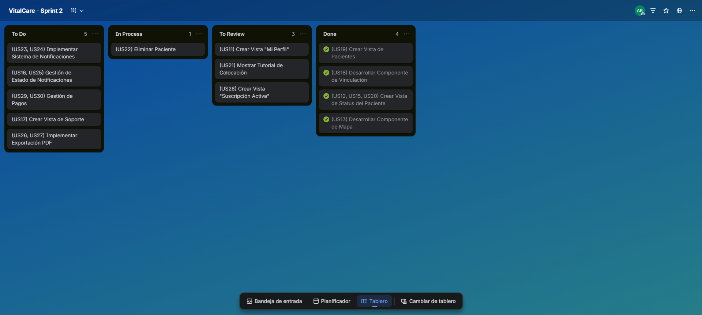

Enlace de Trello: https://trello.com/b/dNCMZ5xN/vitalcare-sprint-2

#### 5.2.2.4. Development Evidence for Sprint Review

Aquí se presentará el registro de commits de aplicación frontend durante el Sprint 2, evidenciando el desarrollo de funcionalidades relacionadas con la gestión de pacientes, historial médico, suscripciones y otros aspectos clave del sistema VitalCare.

| Repository | Branch | Commit Id | Commit Message | Commit Message Body | Committed on (Date) |
| :--- | :--- | :--- | :--- | :--- | :--- |
| `VitalCare-Frontend` | `master` | `140b377` | `Add patient history model and vercel config` | `Added patient history model and Vercel deployment configuration.` | 12/05/2026 |
| `VitalCare-Frontend` | `master` | `9a7836` | `Merge branch 'release/1.0.0' into master` | `Merged release/1.0.0 branch into master for version 1.0.0 release.` | 12/05/2026 |
| `VitalCare-Frontend` | `develop` | `c1870b` | `Merge branch 'origin/feature/suscription' into develop` | `Merged feature/suscription branch from remote into develop.` | 12/05/2026 |
| `VitalCare-Frontend` | `master` | `54e119` | `feat: add patient history model and integrate into patient view` | `Added patient history model and integrated it into the patient view component.` | 12/05/2026 |
| `VitalCare-Frontend` | `master` | `b7d1ea` | `Merge remote-tracking branch 'origin/feature/patients' into feature/patients` | `Merged remote tracking branch for feature/patients.` | 12/05/2026 |
| `VitalCare-Frontend` | `master` | `3c5ddb` | `feat: add patient history model with loading and error states, update styles and layout` | `Added patient history model with loading/error states and updated component styles and layout.` | 12/05/2026 |
| `VitalCare-Frontend` | `master` | `a2d4e2` | `chore: update mock data in db.json for subscriptions` | `Updated mock subscription data in db.json file.` | 12/05/2026 |
| `VitalCare-Frontend` | `master` | `0c425b` | `feat: integrate main plans view and update application routes` | `Integrated main plans view component and updated application routing configuration.` | 12/05/2026 |
| `VitalCare-Frontend` | `master` | `c940335` | `feat: create reusable plan-card component` | `Created a reusable plan-card component for displaying subscription plans.` | 12/05/2026 |
| `VitalCare-Frontend` | `master` | `7829f80` | `feat: add facade service for subscription management` | `Added facade service to handle subscription management operations.` | 12/05/2026 |
| `VitalCare-Frontend` | `master` | `d029ca9` | `feat: implement domain entities and http service for subscriptions` | `Implemented domain entities and HTTP service for subscription management.` | 12/05/2026 |
| `VitalCare-Frontend` | `master` | `8138fa1` | `chore: update environment configuration and angular settings` | `Updated environment configuration and Angular project settings.` | 12/05/2026 |
| `VitalCare-Frontend` | `master` | `ed6f6a2` | `agreed notifications 3` | `Updated notification configuration and settings.` | 12/05/2026 |
| `VitalCare-Frontend` | `master` | `4972829` | `fix: remove placeholder files and clean code` | `Removed placeholder files and cleaned up code.` | 12/05/2026 |
| `VitalCare-Frontend` | `master` | `d7065e5` | `feat: add patient model with form and photo upload` | `Added patient model with form component and photo upload functionality.` | 12/05/2026 |
| `VitalCare-Frontend` | `master` | `babc644` | `fix: add missing modal location, expand the metrics for missing vital signs, add missing translation and clean code` | `Added missing modal, expanded metrics for vital signs, added missing translations and cleaned code.` | 12/05/2026 |
| `VitalCare-Frontend` | `master` | `8b347e7` | `feat: add location management with assembler, entity, resource, and service` | `Added location management with assembler, domain entity, resource, and service layers.` | 12/05/2026 |
| `VitalCare-Frontend` | `master` | `14e681e` | `feat: add vital signs model and related services for patient monitoring` | `Added vital signs model and related services for patient monitoring functionality.` | 12/05/2026 |
| `VitalCare-Frontend` | `master` | `954f831` | `feat: implement patient management module with entity, service, and UI components` | `Implemented patient management module with domain entity, service, and UI components.` | 12/05/2026 |
| `VitalCare-Frontend` | `master` | `f5e46d3` | `feat: add initial application structure with routing and localization support` | `Added initial application structure with routing and i18n localization support.` | 10/05/2026 |
| `VitalCare-Frontend` | `master` | `8add6d1` | `initial commit` | `Initial repository setup with base project files.` | 09/05/2026 |

#### 5.2.2.5. Execution Evidence for Sprint Review

Aquí se muestran las funciones desarrolladas para esta entrega, algunas funciones fueron descartadas como el IAM por ser un módulo que se hará para la siguiente sprint

---

### Vista Home

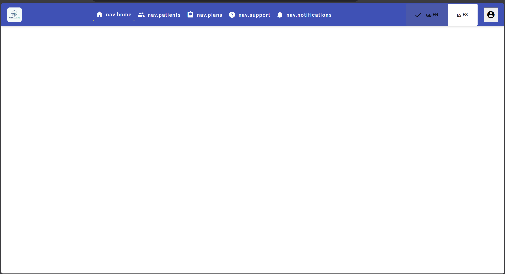

### Vista Pacientes

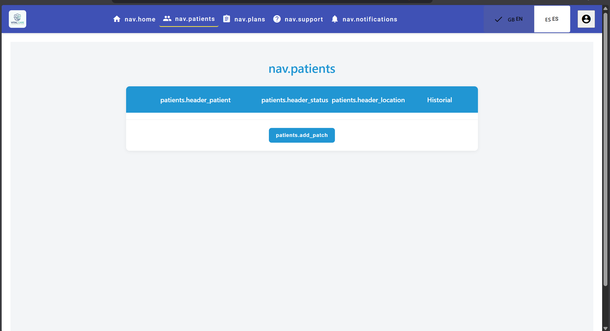

### Vista planes de suscripción

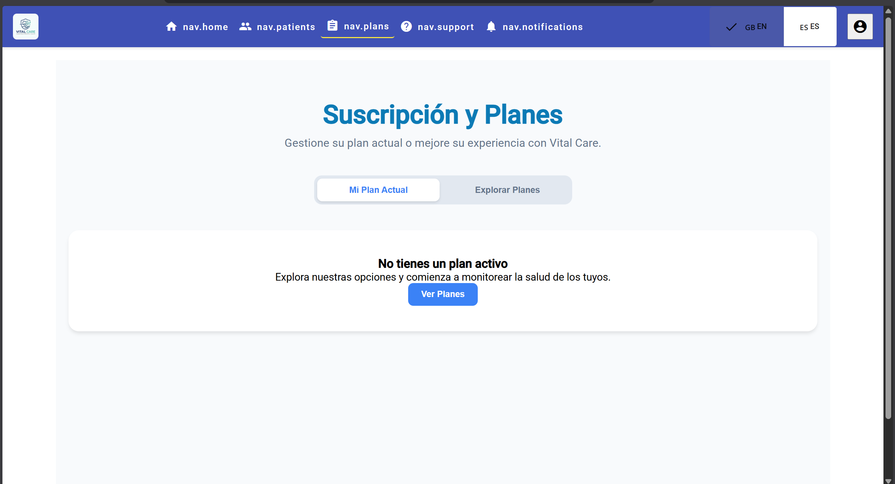

### Vista notificaciones

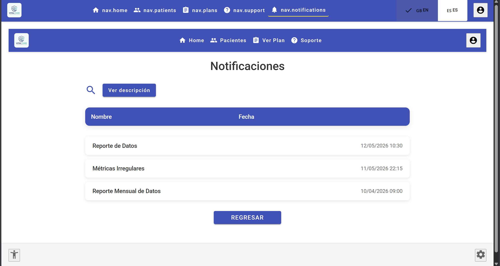

#### 5.2.2.6. Services Documentation Evidence for Sprint Review

Durante el desarrollo del frontend de la aplicación, se decidió emplear JSON Server como una API simulada, debido a que el backend aún no se encontraba implementado. Esta herramienta permitió recrear el comportamiento de un servidor real, atendiendo solicitudes HTTP como GET, POST, PUT y DELETE mediante el uso de un archivo db.json que actuaba como base de datos persistente. Gracias a ello, fue posible continuar con la construcción, validación y prueba de los componentes y servicios del frontend de forma eficiente, manteniendo además una arquitectura desacoplada y preparada para integrarse posteriormente con el backend definitivo.

En este sprint, se documentaron y probaron distintos recursos utilizando JSON Server como fake API. Todos ellos soportan los métodos HTTP: GET, POST, PUT, PATCH, DELETE y OPTIONS.

| Recurso           | Registros existentes en db.json | Métodos HTTP Disponibles               |
|-------------------|---------------------------------|----------------------------------------|
| /notifications    | 3                               | GET, POST, PUT, PATCH, DELETE, OPTIONS |
| /users            | 10                              | GET, POST, PUT, PATCH, DELETE, OPTIONS |
| /user_preferences | 10                              | GET, POST, PUT, PATCH, DELETE, OPTIONS |
| /subscriptions    | 10                              | GET, POST, PUT, PATCH, DELETE, OPTIONS |
| /patients         | 10                              | GET, POST, PUT, PATCH, DELETE, OPTIONS |
| /patches          | 10                              | GET, POST, PUT, PATCH, DELETE, OPTIONS |
| /vital_signs      | 10                              | GET, POST, PUT, PATCH, DELETE, OPTIONS |
| /alerts           | 10                              | GET, POST, PUT, PATCH, DELETE, OPTIONS |
| /support_tickets  | 10                              | GET, POST, PUT, PATCH, DELETE, OPTIONS |
| /locations        | 10                              | GET, POST, PUT, PATCH, DELETE, OPTIONS |

#### 5.2.2.7. Software Deployment Evidence for Sprint Review

En esta sección se mostrará la evidencia de ejecución de la primera versión de la aplicación web desplegada aen Vercel

---

### En esta sección se muestra el ingreso del repositorio en la app de Vercel

### Aquí se muestra el proceso previo al despliegue de la aplicación web en Vercel

### Aquí se muestra la aplicación ya desplegada en Vercel, con la URL pública para su acceso

Enlace: https://vitalcarefrontend.vercel.app/home

#### 5.2.2.8. Team Collaboration Insights during Sprint

En esta sección se evidencia la colaboración del equipo durante el Sprint 2 en el desarrollo de la primera versión del frontend de Vital Care.

**Repositorio de Frontend:** VitalCare-Frontend

---

### 5.2.3. Sprint 3

#### 5.2.3.1. Sprint Planning 3

A continuación se presenta el resumen del Sprint Planning Meeting
realizado para el Sprint 3.

| Sprint # | Sprint 3                                                                                                                                                                                                                                                                                                                                                                                                                                        |
|---|-------------------------------------------------------------------------------------------------------------------------------------------------------------------------------------------------------------------------------------------------------------------------------------------------------------------------------------------------------------------------------------------------------------------------------------------------|
| **Sprint Planning Background** |                                                                                                                                                                                                                                                                                                                                                                                                                                                 |
| Date | 2026-06-08                                                                                                                                                                                                                                                                                                                                                                                                                                      |
| Time | 04:30 PM                                                                                                                                                                                                                                                                                                                                                                                                                                        |
| Location | Reunión virtual vía Google Meet                                                                                                                                                                                                                                                                                                                                                                                                                 |
| Prepared By | Rioja Nuñez, Franco Diego                                                                                                                                                                                                                                                                                                                                                                                                                       |
| Attendees | Bardales Tejada, Luis Alexis / Caisahuana Osores, Becker Junior / Huaman Gallardo, Bruno Aldair / Rioja Nuñez, Franco Diego / Rocca Mariaca, Angel Mathias                                                                                                                                                                                                                                                                                      |
| Sprint 3 – 2 Review Summary | Sprint 2 was successfully completed with the first version of the web application deployed on Vercel. All core frontend modules were implemented, including patient management, subscription plans, notifications, and vital signs visualization. The team used JSON Server as a mock API to simulate backend behavior, which validated the frontend architecture and confirmed the need for a real backend.                                    |
| Sprint 3 – 2 Retrospective Summary | The team acknowledges that the frontend was delivered on time and met the acceptance criteria, though certain features such as IAM were deferred. The use of a mock API was effective for frontend development but highlighted the critical dependency on a production-ready backend. The team agrees to prioritize the RESTful API layer in this sprint to enable full-stack integration and remove the reliance on simulated data.            |
| **Sprint Goal & User Stories** |                                                                                                                                                                                                                                                                                                                                                                                                                                                 |
| Sprint 3 Goal | Our focus is on designing and implementing the RESTful API layer of VitalCare using Spring Boot with a Domain-Driven Design approach. We believe this will provide a secure, scalable, and well-documented backend that supports user management, authentication, health metrics, medical linking, alerts, subscriptions, and reporting. This will be validated once all web services are deployed, tested, and documented via OpenAPI/Swagger. |
| Sprint 3 Velocity | 52                                                                                                                                                                                                                                                                                                                                                                                                                                              |
| Sum of Story Points | 52                                                                                                                                                                                                                                                                                                                                                                                                                                              |

#### 5.2.3.2. Aspect Leaders and Collaborators 
En esta sección se presenta la matriz de liderazgo y colaboración correspondiente al Sprint 3. Durante este sprint, el equipo enfocó sus esfuerzos en fortalecer la arquitectura de la solución, implementar funcionalidades pendientes del módulo IAM, avanzar en la documentación técnica y preparar evidencia de despliegue, validación y colaboración.

| Team Member (Last Name, First Name) | GitHub Username | Backend Web Services | IAM & Authentication | Frontend Integration | API Documentation | Deployment Evidence | Validation & Report |
| :--- | :--- | :---: | :---: | :---: | :---: | :---: | :---: |
| Rioja Nuñez, Franco Diego | FrancoDiegoR | **L** | C | C | C | C | C |
| Rocca Mariaca, Angel Mathias | MRMpro13 | C | C | C | **L** | C | C |
| Huaman Gallardo, Bruno Aldair | BrunoHG10 | C | C | **L** | C | C | C |
| Caisahuana Osores, Becker Junior | becker693 | C | C | C | C | **L** | C |
| Bardales Tejada, Luis Alexis | AlexisBardales | C | **L** | C | C | C | **L** |

**Leyenda:**  
**L**: Líder del aspecto.  
**C**: Colaborador del aspecto.

#### 5.2.3.3. Sprint Backlog 3
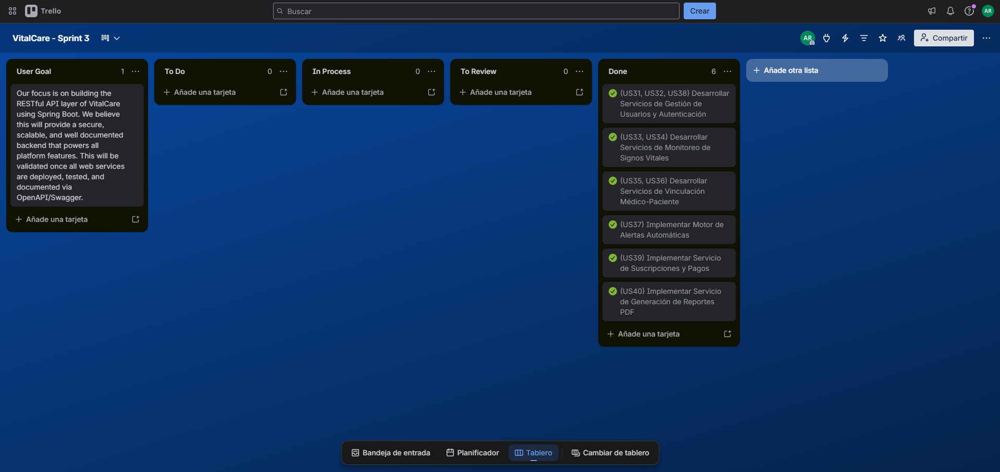

Enlace de Trello: https://trello.com/b/y04JN7v0/vitalcare-sprint-3

#### 5.2.3.4. Development Evidence for Sprint Review
Durante el Sprint 3, el equipo continuó el desarrollo de la aplicación web de VitalCare, incorporando funcionalidades relacionadas con IAM, autenticación, registro de usuarios, recuperación de contraseña, mejoras en el módulo de notificaciones y ajustes de navegación. Además, se implementó el backend del proyecto con Spring Boot, incluyendo los bounded contexts de IAM, Patients, Notifications y Subscription, junto con la configuración de seguridad JWT, despliegue con Docker y conexión a base de datos MySQL. Se mantuvo el uso de GitHub como sistema de control de versiones, aplicando commits para evidenciar el avance incremental del producto.

**Repository:** `1ASI0729-2610-10177-ByteCore-VitalCare/VitalCare-Frontend`

| Repository | Branch | Commit Id | Commit Message | Commit Message Body | Committed on (Date) |
| :--- | :--- | :--- | :--- | :--- | :--- |
| `VitalCare-Frontend` | `master` | `83f9d04` | `redirect to login after registration` | Updated the registration flow so users return to the login page after creating an account instead of being automatically authenticated. | 13/06/2026 |
| `VitalCare-Frontend` | `master` | `4d5e1d5` | `add registration page` | Added the user registration page with form validation and integration with the mock users API. | 13/06/2026 |
| `VitalCare-Frontend` | `master` | `027c6dd` | `add login and password reset flow` | Implemented the IAM login flow, route protection, logout behavior and password reset page. | 08/06/2026 |
| `VitalCare-Frontend` | `master` | `81f37b8` | `add login and password reset flow` | Added initial authentication components, services and route configuration for the IAM module. | 08/06/2026 |
| `VitalCare-Frontend` | `master` | `f522df0` | `Update notification.service.ts` | Updated the notification service to support improvements in the notifications module. | 13/06/2026 |
| `VitalCare-Frontend` | `master` | `cb4580c` | `Update notifications.css` | Updated the visual styling of the notifications view. | 13/06/2026 |
| `VitalCare-Frontend` | `master` | `43edf18` | `Update notifications.html` | Updated the structure of the notifications interface. | 13/06/2026 |
| `VitalCare-Frontend` | `master` | `d460379` | `Update notifications.ts` | Updated the TypeScript logic of the notifications view. | 13/06/2026 |

**Repository:** `1ASI0729-2610-10177-ByteCore-VitalCare/VitalCare-Backend`

| Repository | Branch | Commit Id | Commit Message | Commit Message Body | Committed on (Date) |
| :--- | :--- | :--- | :--- | :--- | :--- |
| `VitalCare-Backend` | `main` | `0f919e2` | `chore: initial commit` | Initial project setup with Spring Boot 3, Maven wrapper and base project structure. | 05/06/2026 |
| `VitalCare-Backend` | `feature/iam` | `6090faf` | `feat(iam): add IAM bounded context domain layer` | Added User aggregate, SignIn/SignUp commands, queries and repository interfaces for the IAM bounded context. | 05/06/2026 |
| `VitalCare-Backend` | `feature/patients` | `b98886b` | `feat(patients): add patients bounded context domain layer` | Added Patient aggregate, Patch entity, CreatePatient and LinkPatch commands, queries and repositories. | 05/06/2026 |
| `VitalCare-Backend` | `feature/notifications` | `df3cda3` | `feat(notifications): add notifications bounded context domain layer` | Added Alert aggregate, CreateAlert and MarkAlertAsRead commands, queries and AlertRepository. | 05/06/2026 |
| `VitalCare-Backend` | `feature/suscription` | `84a6c13` | `feat(suscription): add suscription bounded context domain layer` | Added Subscription aggregate, CreateSubscription command, queries and SubscriptionRepository. | 05/06/2026 |
| `VitalCare-Backend` | `feature/patients` | `28f4d98` | `feat(patients): add vital signs and location to patients domain` | Added VitalSign and Location aggregates with their respective commands, queries and repositories. | 05/06/2026 |
| `VitalCare-Backend` | `feature/patients` | `92e8e98` | `feat: add GetVitalSignByIdQuery and UpdateVitalSignCommand` | Implemented query and command for retrieving and updating individual vital sign records. | 13/06/2026 |
| `VitalCare-Backend` | `feature/patients` | `8946b51` | `feat: add GetLocationByIdQuery and UpdateLocationCommand` | Implemented query and command for retrieving and updating individual location records. | 13/06/2026 |
| `VitalCare-Backend` | `feature/patients` | `5f064ab` | `feat: add GetAllPatchesQuery and UpdatePatchCommand` | Added query to retrieve all patches and command to update patch information. | 13/06/2026 |
| `VitalCare-Backend` | `feature/patients` | `f073f1f` | `feat: add deleteById() to all patient repositories` | Added delete operations to PatientRepository, PatchRepository, VitalSignRepository and LocationRepository. | 13/06/2026 |
| `VitalCare-Backend` | `feature/notifications` | `b7c23f1` | `feat(notifications): add application, infrastructure and interfaces layers` | Implemented CQRS services, JPA persistence adapters and REST controller for the Notifications bounded context. | 13/06/2026 |
| `VitalCare-Backend` | `main` | `4acf1f9` | `feat: add Dockerfile for Render deployment` | Added Dockerfile with multi-stage build for containerized deployment on Render platform. | 13/06/2026 |
| `VitalCare-Backend` | `feature/iam` | `2fa6bd7` | `Add IAM authentication with JWT` | Implemented JWT-based authentication with Spring Security, BCrypt hashing and Bearer token service. | 15/06/2026 |
| `VitalCare-Backend` | `feature/suscription` | `4d323e3` | `refactor(subscription): update domain aggregate mapping and repository signatures for JPA` | Refactored Subscription aggregate with JPA annotations and updated repository method signatures. | 17/06/2026 |
| `VitalCare-Backend` | `feature/suscription` | `94b731b` | `feat(subscription): implement CQRS services and move interfaces to proper application packages` | Added SubscriptionCommandService and SubscriptionQueryService with their implementations. | 17/06/2026 |
| `VitalCare-Backend` | `feature/suscription` | `e59cf3c` | `feat(subscription): expose REST controller endpoints and resources mapping for frontend integration` | Added SubscriptionsController with POST, GET all and GET by userId endpoints with Swagger annotations. | 17/06/2026 |
| `VitalCare-Backend` | `main` | `705dec4` | `feat(iam): setup JPA entities and JWT authentication framework` | Configured JPA entities for User, SupportTicket and UserPreference, along with SecurityConfiguration and JWT filter. | 18/06/2026 |
| `VitalCare-Backend` | `main` | `58fade3` | `config: enable CORS for frontend domains` | Configured CORS to allow requests from the Vercel-deployed frontend and localhost development environments. | 19/06/2026 |
| `VitalCare-Backend` | `main` | `106776e` | `fix: consolidate CORS configuration into existing SecurityConfiguration with JWT filter` | Unified CORS and security configuration to resolve 403 Forbidden errors on cross-origin API requests. | 19/06/2026 |
| `VitalCare-Backend` | `main` | `25d3466` | `fix: use single connection pool with no schema validation to stay under max_user_connections limit` | Optimized HikariCP connection pool settings for production MySQL database constraints. | 19/06/2026 |

#### 5.2.3.5. Execution Evidence for Sprint Review

Durante el Sprint 3, se logró la ejecución exitosa del backend de VitalCare, incluyendo el despliegue del Web Service con Spring Boot y la conexión con la base de datos MySQL en la nube. A continuación se presentan las evidencias de ejecución de los servicios desarrollados.

**Configuración del Web Service en Render**

Se configuró el servicio VitalCare-Backend en Render vinculando el repositorio de GitHub, seleccionando Docker como runtime, la rama `master` para el despliegue, la región Virginia (US East) y las variables de entorno necesarias para la conexión con la base de datos y la autenticación JWT.

**Base de datos MySQL en producción**

Se evidencia la conexión exitosa del backend con la base de datos MySQL v5.7.38 alojada en Filess.io, la cual almacena los datos persistentes de los bounded contexts de IAM, Patients, Notifications y Subscription.

#### 5.2.3.6. Services Documentation Evidence for Sprint Review

Durante el Sprint 3, se implementó el backend de VitalCare utilizando Spring Boot 3 con Java 21, siguiendo una arquitectura basada en Domain-Driven Design (DDD) con el patrón CQRS (Command Query Responsibility Segregation). El backend expone una API RESTful documentada mediante OpenAPI 3.0 (Swagger), integrada a través de la dependencia `springdoc-openapi-starter-webmvc-ui`. La documentación interactiva se encuentra disponible en la ruta `/swagger-ui/index.html` del servidor desplegado.

La API implementa autenticación basada en JWT (JSON Web Token) con esquema Bearer, y se organiza en cuatro bounded contexts principales: IAM (Identity and Access Management), Patients, Notifications y Subscription.

A continuación se detallan los endpoints RESTful implementados y documentados:

Bounded Context: IAM (Identity and Access Management)

| Endpoint | Método HTTP | Descripción | Request Body | Response |
| :--- | :--- | :--- | :--- | :--- |
| `/api/v1/authentication/sign-up` | `POST` | Registro de un nuevo usuario en la plataforma | `SignUpResource` (name, email, password) | `AuthenticatedUserResource` (id, name, email, token) |
| `/api/v1/authentication/sign-in` | `POST` | Inicio de sesión con credenciales | `SignInResource` (email, password) | `AuthenticatedUserResource` (id, name, email, token) |

Bounded Context: Patients

El bounded context de Patients cuenta con la capa de dominio completamente implementada siguiendo DDD, incluyendo los aggregates, commands, queries, value objects y repositories. La capa de interfaces REST (controllers) se encuentra en desarrollo para los próximos sprints. A continuación se describen los modelos de dominio implementados:

| Aggregate / Entity | Atributos principales | Commands | Queries |
| :--- | :--- | :--- | :--- |
| `Patient` | id, name, birthDate, gender (MALE/FEMALE/OTHER), photo, userId, patches | `CreatePatientCommand`, `UpdatePatientCommand`, `DeletePatientCommand` | `GetAllPatientsQuery`, `GetPatientByIdQuery`, `GetPatientsByUserIdQuery` |
| `Patch` (Entity) | id, patchCode, linkedAt, status (ACTIVE/INACTIVE/LOW_BATTERY/ERROR) | `LinkPatchCommand`, `UpdatePatchCommand`, `UpdatePatchStatusCommand`, `DeletePatchCommand` | `GetAllPatchesQuery`, `GetPatchByIdQuery`, `GetPatchesByPatientIdQuery` |
| `VitalSign` | id, recordedAt, glucoseLevel, lactateConcentration, alcoholLevel, ketones, bloodPressure, temperature, oxygenSaturation, sodiumPotassium, heartRate, cytokines, tCells, humidity, atmosphericPressure, airQuality, patchId | `RecordVitalSignCommand`, `UpdateVitalSignCommand`, `DeleteVitalSignCommand` | `GetAllVitalSignsQuery`, `GetVitalSignByIdQuery`, `GetVitalSignsByPatchIdQuery` |
| `Location` | id, latitude, longitude, recordedAt, patchId | `RecordLocationCommand`, `UpdateLocationCommand`, `DeleteLocationCommand` | `GetAllLocationsQuery`, `GetLocationByIdQuery`, `GetLocationsByPatchIdQuery` |

Bounded Context: Notifications

| Endpoint | Método HTTP | Descripción | Request Body / Params | Response |
| :--- | :--- | :--- | :--- | :--- |
| `/api/v1/alerts` | `GET` | Obtener todas las alertas (filtrable por `userId` o `patientId`) | Query params: `userId`, `patientId` (opcionales) | `List<AlertResource>` |
| `/api/v1/alerts/{alertId}` | `GET` | Obtener una alerta por su ID | Path param: `alertId` | `AlertResource` (id, type, description, isRead, userId, patientId) |
| `/api/v1/alerts` | `POST` | Crear una nueva alerta | `CreateAlertResource` (type: CRITICAL/WARNING/INFO, description, userId, patientId) | `AlertResource` |
| `/api/v1/alerts/{alertId}/read` | `PATCH` | Marcar una alerta como leída | Path param: `alertId` | `AlertResource` |

Bounded Context: Subscription

| Endpoint | Método HTTP | Descripción | Request Body / Params | Response |
| :--- | :--- | :--- | :--- | :--- |
| `/api/v1/subscriptions` | `POST` | Crear una nueva suscripción | `CreateSubscriptionResource` (userId, plan, price, startDate, endDate) | `SubscriptionResource` |
| `/api/v1/subscriptions` | `GET` | Obtener todas las suscripciones | — | `List<SubscriptionResource>` (id, userId, plan, price, startDate, endDate, status) |
| `/api/v1/subscriptions/user/{userId}` | `GET` | Obtener la suscripción activa de un usuario | Path param: `userId` | `SubscriptionResource` |

Los planes de suscripción disponibles son: `FREE`, `SILVER` y `GOLD`, con estados posibles: `ACTIVE`, `EXPIRED`, `PENDING` y `CANCELED`.

#### 5.2.3.7. Software Deployment Evidence for Sprint Review

Durante el Sprint 3, se realizó el despliegue completo del backend de VitalCare, incluyendo el Web Service desarrollado con Spring Boot y la base de datos MySQL en la nube. A continuación se describen las actividades y evidencias del proceso de despliegue.

**1. Creación del Web Service en Render**

Se configuró un nuevo Web Service en la plataforma **Render**, vinculando directamente el repositorio `1ASI0729-2610-10177-ByteCore-VitalCare/VitalCare-Backend` desde GitHub. La configuración incluyó:
- **Nombre del servicio:** VitalCare-Backend
- **Lenguaje/Runtime:** Docker (utilizando el Dockerfile del repositorio con build multi-stage)
- **Branch de despliegue:** `master`
- **Región:** Virginia (US East)
- **Tipo de instancia:** Free (512 MB RAM, 0.1 CPU)
- **Variables de entorno configuradas:** `SPRING_DATASOURCE_URL`, `SPRING_DATASOURCE_USERNAME`, `SPRING_DATASOURCE_PASSWORD`, `SPRING_PROFILES_ACTIVE`, `AUTHORIZATION_JWT_EXPIRATION_DAYS` y `JWT_SECRET`

**2. Despliegue exitoso del Backend en Render**

El servicio fue desplegado exitosamente el 19 de junio de 2026. Los logs de Render confirman que la aplicación Spring Boot inició correctamente con Tomcat en el puerto 10000, y que la plataforma VitalCare quedó disponible en la URL pública proporcionada por Render: `https://vitalcare-backend-7y66.onrender.com`.

**3. Aprovisionamiento de la Base de Datos MySQL en Filess.io**

Se provisionó una instancia de base de datos **MySQL v5.7.38** en la plataforma **Filess.io** bajo un plan compartido (Shared). La configuración de la base de datos es la siguiente:
- **Región:** Mumbai (ind-1)
- **Host:** `d9xqq3.h.filess.io`
- **Puerto:** 3306
- **Base de datos:** `vital_care_db_laborarehe`

Esta base de datos es consumida por el Web Service desplegado en Render mediante las variables de entorno de conexión JDBC configuradas previamente.

**4. Documentación Swagger UI del Web Service desplegado**

Se verificó que la documentación interactiva de la API generada por **SpringDoc OpenAPI (Swagger UI)** se encuentra disponible y funcional. La interfaz muestra los tres controllers implementados: **Subscriptions** (3 endpoints), **authentication-controller** (2 endpoints) y **alerts-controller** (4 endpoints), junto con los schemas de los recursos (`CreateSubscriptionResource`, `SignUpResource`, `SignInResource`, `CreateAlertResource`, `SubscriptionResource`, `AlertResource`).

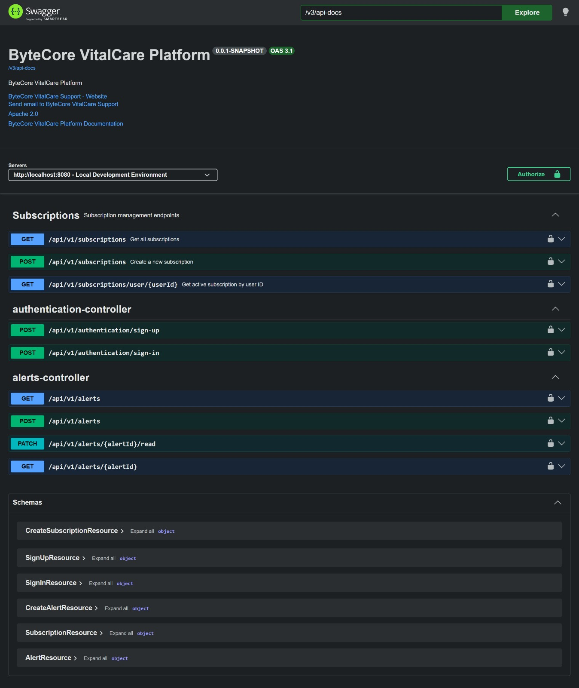

#### 5.2.3.8. Team Collaboration Insights during Sprint

En esta sección se evidencia la colaboración del equipo durante el Sprint 3 en el desarrollo del frontend, backend y reporte del proyecto VitalCare. Se presentan las contribuciones de cada miembro del equipo registradas en los repositorios de GitHub.

### Repositorio: VitalCare-Proyect-Report

### Repositorio: VitalCare-Frontend

### Repositorio: VitalCare-Backend

---

## 5.2.4. Sprint 4
Durante el Sprint 4 se consolidó la versión final de VitalCare para la entrega TB2. El trabajo se enfocó en completar la integración entre frontend y backend, ampliar la cobertura de endpoints REST, estabilizar la configuración de despliegue, mejorar la experiencia de usuario y cerrar las evidencias finales del proyecto.

#### 5.2.4.1. Sprint Planning 4
A continuación se presenta el resumen del Sprint Planning Meeting realizado para el Sprint 4.

| Sprint # | Sprint 4 |
|---|---|
| **Sprint Planning Background** |  |
| Date | 2026-07-01 |
| Time | 04:30 PM |
| Location | Reunión virtual vía Google Meet |
| Prepared By | Rioja Nuñez, Franco Diego |
| Attendees | Bardales Tejada, Luis Alexis / Caisahuana Osores, Becker Junior / Huaman Gallardo, Bruno Aldair / Rioja Nuñez, Franco Diego / Rocca Mariaca, Angel Mathias |
| Sprint 4 - 3 Review Summary | Sprint 3 permitió disponer de una primera versión funcional del backend, con autenticación, alertas, suscripciones y despliegue inicial. |
| Sprint 4 - 3 Retrospective Summary | El equipo identificó como principales oportunidades de mejora la estabilidad del despliegue, la documentación completa de servicios, la corrección de problemas de CORS y la experiencia final de usuario. |
| **Sprint Goal & User Stories** |  |
| Sprint 4 Goal | Completar la versión final de VitalCare integrando frontend, backend, despliegue y documentación final para TB2. |
| Sprint 4 Velocity | 55 |
| Sum of Story Points | 55 |

#### 5.2.4.2. Aspect Leaders and Collaborators
En esta sección se presenta la matriz de liderazgo y colaboración correspondiente al Sprint 4. Cada integrante asumió responsabilidad sobre un aspecto final de la solución, manteniendo colaboración transversal para cerrar la versión final del proyecto.

| Team Member (Last Name, First Name) | GitHub Username | Backend Stabilization | Frontend Final Integration | API Documentation | Deployment & Cloud Evidence | Validation & Final Report |
| :--- | :--- | :---: | :---: | :---: | :---: | :---: |
| Rioja Nuñez, Franco Diego | FrancoDiegoR | **L** | C | C | C | **L** |
| Bardales Tejada, Luis Alexis | AlexisBardales | **L** | C | C | C | C |
| Caisahuana Osores, Becker Junior | becker693 | C | C | **L** | **L** | C |
| Huaman Gallardo, Bruno Aldair | BrunoHG10 | C | **L** | C | C | C |
| Rocca Mariaca, Angel Mathias | MRMpro13 | C | C | C | C | **L** |

**Leyenda:**  
**L**: Líder del aspecto.  
**C**: Colaborador del aspecto.

#### 5.2.4.3. Sprint Backlog 4
El Sprint Backlog 4 se organizó alrededor de historias de usuario y tareas técnicas necesarias para entregar una versión final integrada de VitalCare.

| Item | User Story / Task | Descripción | Responsable principal | Story Points | Estado |
|---:|---|---|---|---:|---|
| 1 | US31 - User registration service | Completar registro de usuarios y respuesta de autenticación con datos requeridos por frontend. | Bardales Tejada, Luis Alexis | 5 | Done |
| 2 | US32 - Authentication service | Estabilizar login, token JWT, permisos públicos y configuración de seguridad. | Bardales Tejada, Luis Alexis | 5 | Done |
| 3 | US33 - Metrics service | Implementar endpoints de signos vitales para registro, consulta, actualización y eliminación. | Rioja Nuñez, Franco Diego | 8 | Done |
| 4 | US34 - Metrics retrieval service | Exponer endpoints de historial de signos vitales, ubicaciones y parches. | Rioja Nuñez, Franco Diego | 5 | Done |
| 5 | US36 - Patient listing service | Completar CRUD de pacientes y consumo desde frontend. | Rocca Mariaca, Angel Mathias | 5 | Done |
| 6 | US37 - Alert service | Implementar endpoints de notificaciones, alertas y marcado de lectura. | Huaman Gallardo, Bruno Aldair | 8 | Done |
| 7 | US38 - Profile update service | Agregar preferencias de usuario, perfil y soporte técnico. | Bardales Tejada, Luis Alexis | 5 | Done |
| 8 | US39 - Subscription service | Permitir consulta, creación y actualización de planes de suscripción. | Caisahuana Osores, Becker Junior | 5 | Done |
| 9 | Deployment task | Ajustar CORS, variables de entorno y despliegue final del backend y frontend. | Caisahuana Osores, Becker Junior | 5 | Done |
| 10 | Documentation task | Actualizar reporte final TB2, conclusiones, bibliografía, anexos y evidencias. | Rioja Nuñez, Franco Diego | 4 | Done |

Enlace de Trello: https://trello.com/b/QlITZUNa/vitalcare-sprint-4

#### 5.2.4.4. Development Evidence for Sprint Review

Durante el Sprint 4, el equipo cerró la implementación final del backend y realizó ajustes de integración para que la aplicación web consumiera los recursos requeridos por VitalCare. A continuación se presentan los commits más relevantes asociados al cierre del proyecto.

**Repository:** `1ASI0729-2610-10177-ByteCore-VitalCare/VitalCare-Backend`

| Repository | Branch | Commit Id | Commit Message | Commit Message Body | Committed on (Date) |
| :--- | :--- | :--- | :--- | :--- | :--- |
| `VitalCare-Backend` | `master` | `3cb1de9` | `feat(iam): add users and support tickets endpoints` | Added REST endpoints for user lookup and support ticket registration. | 2026-06 |
| `VitalCare-Backend` | `master` | `bcb01f4` | `feat(iam): add user preferences endpoints` | Added endpoints for managing accessibility and notification preferences. | 2026-06 |
| `VitalCare-Backend` | `master` | `b397c37` | `feat(patients): add patients, patches, vital signs and locations endpoints` | Exposed CRUD endpoints for the Patients bounded context. | 2026-06 |
| `VitalCare-Backend` | `master` | `895d3ef` | `feat(notifications): add notifications endpoints` | Added REST endpoints for notification listing, creation and deletion. | 2026-06 |
| `VitalCare-Backend` | `master` | `4be6726` | `fix(subscription): add user filter, plan update endpoint and auto-activate on creation` | Improved subscription filtering and update behavior for frontend integration. | 2026-06 |
| `VitalCare-Backend` | `master` | `71cb577` | `fix(cors): allow all Vercel deployment origins including preview URLs` | Updated CORS configuration to support deployed frontend environments. | 2026-06 |
| `VitalCare-Backend` | `master` | `147ef94` | `fix(patients): remove broken Patient-Patch mapping, enable ddl-auto update and permit /error` | Stabilized persistence mappings and deployment behavior. | 2026-06 |
| `VitalCare-Backend` | `master` | `c15e92a` | `fix(subscription): add BASIC to SubscriptionPlan enum to allow downgrade to basic plan` | Completed subscription plan compatibility for final flow. | 2026-06 |
| `VitalCare-Backend` | `master` | `ecd54c1` | `fix(iam): add DEFAULT, GREEN, YELLOW to BackgroundColor enum for preferences` | Completed preference values required by frontend accessibility settings. | 2026-06 |

**Repository:** `1ASI0729-2610-10177-ByteCore-VitalCare/VitalCare-Frontend`

| Repository | Branch | Commit Id | Commit Message | Commit Message Body | Committed on (Date) |
| :--- | :--- | :--- | :--- | :--- | :--- |
| `VitalCare-Frontend` | `master` | `103f50d` | Final frontend update for TB2 | Integrated profile, support, register, accessibility, notifications, patients, plans and final dashboard improvements. | 2026-07 |
| `VitalCare-Frontend` | `master` | `83f9d04` | `redirect to login after registration` | Updated the registration flow so users return to login after account creation. | 2026-06 |
| `VitalCare-Frontend` | `master` | `4d5e1d5` | `add registration page` | Added registration page with form validation and mock/API integration. | 2026-06 |
| `VitalCare-Frontend` | `master` | `027c6dd` | `add login and password reset flow` | Implemented IAM login, route protection and password reset flow. | 2026-06 |

#### 5.2.4.5. Execution Evidence for Sprint Review

En esta sección se resume la ejecución de la versión final de VitalCare. La aplicación web permite al usuario acceder mediante autenticación, visualizar el dashboard, gestionar pacientes, revisar signos vitales, consultar alertas, configurar preferencias, administrar planes de suscripción y enviar tickets de soporte.

| Flujo ejecutado | Evidencia funcional | Resultado |
|---|---|---|
| Login y registro | Validación de credenciales, creación de cuenta y redirección al login. | Completado |
| Dashboard principal | Visualización de KPIs, pacientes, suscripciones, alertas y estado general. | Completado |
| Gestión de pacientes | Consulta, creación y actualización de pacientes asociados al usuario. | Completado |
| Signos vitales y ubicación | Consulta de registros de signos vitales, parches y ubicaciones. | Completado |
| Notificaciones y alertas | Listado de notificaciones, alertas críticas y actualización de lectura. | Completado |
| Perfil y preferencias | Configuración de idioma, accesibilidad y preferencias visuales. | Completado |
| Suscripciones | Consulta y actualización de planes de suscripción. | Completado |
| Soporte | Registro de tickets de soporte desde la aplicación web. | Completado |

**Evidencia de pantallas implementadas en la aplicación web**

**Frontend**

Se evidencia el despliegue exitoso del frontend en Vercel, mostrando la pantalla de inicio de sesión de VitalCare correctamente renderizada en el dominio de producción `vital-care-frontend.vercel.app`.

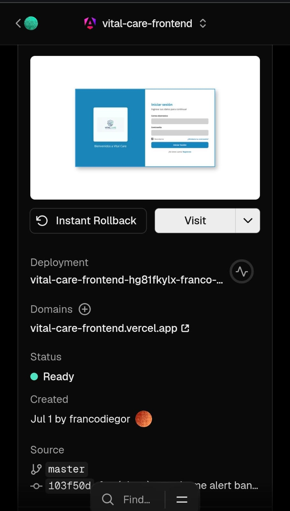

**Backend**

Se evidencia la ejecución exitosa del Web Service VitalCare-Backend en Render, con el despliegue en estado activo correspondiente al commit `ecd54c1`, disponible en la URL `https://vitalcare-backend-7y66.onrender.com`.

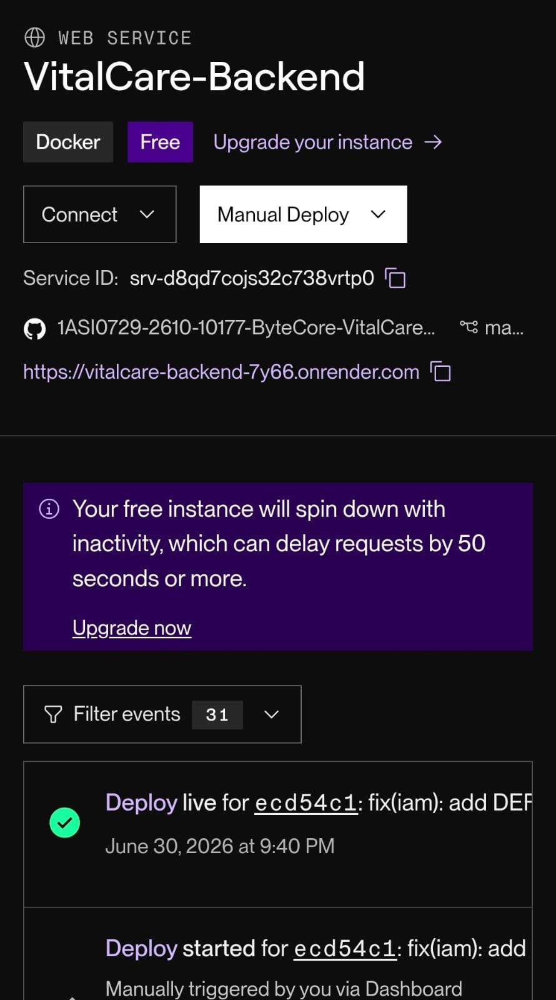

#### 5.2.4.6. Services Documentation Evidence for Sprint Review

Durante el Sprint 4 se completó y documentó una cobertura más amplia de endpoints RESTful en el backend de VitalCare. La documentación de servicios se mantiene mediante Swagger/OpenAPI y permite probar los recursos disponibles con datos de muestra.

**Repository:** `1ASI0729-2610-10177-ByteCore-VitalCare/VitalCare-Backend`

| Bounded Context | Endpoint | Método HTTP | Acción implementada | Parámetros / Body | Response esperado |
|---|---|---|---|---|---|
| IAM | `/api/v1/authentication/sign-up` | POST | Registrar usuario | `SignUpResource` | `AuthenticatedUserResource` con token |
| IAM | `/api/v1/authentication/sign-in` | POST | Iniciar sesión | `SignInResource` | `AuthenticatedUserResource` con token |
| IAM | `/api/v1/users/{userId}` | GET | Obtener usuario por ID | Path param `userId` | `UserResource` |
| IAM | `/api/v1/user_preferences` | GET | Listar preferencias de usuario | Query params opcionales | `List<UserPreferenceResource>` |
| IAM | `/api/v1/user_preferences` | POST | Crear preferencias | `CreateUserPreferenceResource` | `UserPreferenceResource` |
| IAM | `/api/v1/support_tickets` | GET | Listar tickets de soporte | Query params opcionales | `List<SupportTicketResource>` |
| IAM | `/api/v1/support_tickets` | POST | Registrar ticket de soporte | `CreateSupportTicketResource` | `SupportTicketResource` |
| Patients | `/api/v1/patients` | GET | Listar pacientes | Query params opcionales | `List<PatientResource>` |
| Patients | `/api/v1/patients/{id}` | GET | Obtener paciente por ID | Path param `id` | `PatientResource` |
| Patients | `/api/v1/patients` | POST | Crear paciente | `CreatePatientResource` | `PatientResource` |
| Patients | `/api/v1/patients/{id}` | PUT | Actualizar paciente | Path param `id`, body de actualización | `PatientResource` |
| Patients | `/api/v1/patients/{id}` | DELETE | Eliminar paciente | Path param `id` | HTTP status de eliminación |
| Patients | `/api/v1/patches` | GET/POST | Consultar o registrar parches | Query params o body según acción | `PatchResource` |
| Patients | `/api/v1/vital_signs` | GET/POST | Consultar o registrar signos vitales | Query params o body según acción | `VitalSignResource` |
| Patients | `/api/v1/locations` | GET/POST | Consultar o registrar ubicaciones | Query params o body según acción | `LocationResource` |
| Notifications | `/api/v1/alerts` | GET | Obtener alertas | Query params `userId`, `patientId` | `List<AlertResource>` |
| Notifications | `/api/v1/alerts/{alertId}` | GET | Obtener alerta por ID | Path param `alertId` | `AlertResource` |
| Notifications | `/api/v1/alerts` | POST | Crear alerta | `CreateAlertResource` | `AlertResource` |
| Notifications | `/api/v1/alerts/{alertId}/read` | PATCH | Marcar alerta como leída | Path param `alertId` | `AlertResource` |
| Notifications | `/api/v1/notifications` | GET | Listar notificaciones | Query params opcionales | `List<NotificationResource>` |
| Notifications | `/api/v1/notifications` | POST | Crear notificación | `CreateNotificationResource` | `NotificationResource` |
| Notifications | `/api/v1/notifications/{id}` | DELETE | Eliminar notificación | Path param `id` | HTTP status de eliminación |
| Subscription | `/api/v1/subscriptions` | POST | Crear suscripción | `CreateSubscriptionResource` | `SubscriptionResource` |
| Subscription | `/api/v1/subscriptions` | GET | Obtener suscripciones | Query param opcional `userId` | `List<SubscriptionResource>` |
| Subscription | `/api/v1/subscriptions/{id}` | PATCH | Actualizar plan o estado | Path param `id`, body de actualización | `SubscriptionResource` |

**Ejemplo de interacción documentada**

| Acción | Ejemplo de llamada | Resultado esperado |
|---|---|---|
| Registro | `POST /api/v1/authentication/sign-up` | Creación del usuario y retorno de token JWT. |
| Consulta de pacientes | `GET /api/v1/patients` | Lista de pacientes registrados. |
| Registro de signo vital | `POST /api/v1/vital_signs` | Persistencia de medición asociada a un parche. |
| Actualización de suscripción | `PATCH /api/v1/subscriptions/{id}` | Cambio de plan o estado de suscripción. |

#### 5.2.4.7. Software Deployment Evidence for Sprint Review

Durante el Sprint 4 se estabilizó el despliegue final de los productos digitales de VitalCare. El frontend se mantiene desplegado en Vercel, mientras que el backend se ejecuta como Web Service en Render con conexión a una base de datos MySQL en la nube. La configuración final permitió validar la comunicación entre aplicación web, API RESTful y persistencia.

| Producto | Plataforma | URL / Recurso | Estado |
|---|---|---|---|
| Landing Page | GitHub Pages | `https://1asi0729-2610-10177-bytecore-vitalcare.github.io/VitalCare-Landing-Page/` | Desplegado |
| Frontend Web Application | Vercel | `https://vitalcarefrontend.vercel.app/home` | Desplegado |
| Backend RESTful API | Render | `https://vitalcare-backend-7y66.onrender.com` | Desplegado |
| API Documentation | Swagger UI | `https://vitalcare-backend-7y66.onrender.com/swagger-ui/index.html` | Disponible |
| Database | Filess.io MySQL | `vital_care_db_laborarehe` | Aprovisionada |

**Configuración de despliegue final**

- El backend utiliza Spring Boot 3, Java 21 y Docker para facilitar el despliegue.
- Se configuraron variables de entorno para la conexión MySQL, JWT y perfil de ejecución.
- Se ajustó CORS para permitir el consumo desde dominios de Vercel.
- Se corrigieron restricciones de conexión para operar dentro de límites del proveedor de base de datos.
- Se validó Swagger UI como evidencia de documentación y disponibilidad de endpoints.

#### 5.2.4.8. Team Collaboration Insights during Sprint

Durante el Sprint 4, la colaboración del equipo se concentró en el cierre de la versión final, corrección de errores, integración frontend-backend, despliegue y documentación TB2. Cada integrante participó en tareas de implementación o documentación, manteniendo trazabilidad mediante GitHub y comunicación continua en reuniones virtuales.

| Integrante | Contribución principal en Sprint 4 | Evidencia |
|---|---|---|
| Rioja Nuñez, Franco Diego | Coordinación del cierre TB2, documentación final y soporte en estabilización de backend. | Commits y actualizaciones en Project Report / Backend |
| Bardales Tejada, Luis Alexis | Ajustes IAM, preferencias de usuario, soporte tickets y autenticación. | Commits `3cb1de9`, `bcb01f4`, `ecd54c1` |
| Caisahuana Osores, Becker Junior | Estabilización de suscripciones, despliegue y configuración cloud. | Commits `4be6726`, `c15e92a`, evidencias de Render |
| Huaman Gallardo, Bruno Aldair | Implementación y ajustes de notificaciones y alertas. | Commits `895d3ef`, ajustes en frontend notifications |
| Rocca Mariaca, Angel Mathias | Ajustes de Patients bounded context, vistas finales y evidencias visuales. | Commits `b397c37`, mejoras de vistas pacientes |

**Insights del Sprint**

- El equipo logró cerrar el ciclo completo de producto al integrar frontend, backend y servicios desplegados.
- La estabilización de CORS y variables de entorno fue clave para permitir la comunicación entre Vercel y Render.
- La ampliación de endpoints en Patients, Notifications, IAM y Subscription permitió reemplazar gradualmente el uso de datos simulados.
- La documentación final ayudó a dejar trazabilidad de decisiones técnicas, limitaciones y recomendaciones de mejora.
- Como aprendizaje, el equipo reconoce la necesidad de preparar despliegues cloud con mayor anticipación para reducir riesgos cercanos a la entrega final.

---
# 5.3. Validation Interviews

En esta sección, el equipo registra y explica las actividades de entrevistas de validación durante el proyecto. Se realizaron entrevistas de validación en las que usuarios de los segmentos objetivo interactuaron con el landing page y con la aplicación VitalCare, manifestando sus observaciones y retroalimentación sobre la experiencia proporcionada.

## 5.3.1. Diseño de Entrevistas

### Objetivos de la Validación

El proceso de validación fue diseñado para:

1. **Evaluar la facilidad de uso** de la plataforma VitalCare en ambos segmentos
2. **Validar la efectividad** de las funcionalidades principales:
  - Registro e inicio de sesión
  - Gestión de pacientes (agregar, visualizar información)
  - Monitoreo de signos vitales en tiempo real
  - Recepción y comprensión de alertas de riesgo
  - Acceso a historial médico
  - Gestión de suscripción y planes

3. **Recopilar feedback** sobre el flujo de usuario y la interfaz
4. **Identificar pain points** y oportunidades de mejora
5. **Validar el valor** propuesto para cada segmento

### User Flows Evaluados

**Para Segmento 1 (Cuidadores - 25-40 años):**
- Acceder al landing page
- Crear cuenta / Iniciar sesión
- Agregar paciente a su cuidado
- Visualizar dashboard con signos vitales en tiempo real
- Recibir y reaccionar ante alertas de riesgo
- Acceder al historial médico del paciente
- Revisar opciones de suscripción para funcionalidades premium

**Para Segmento 2 (Adultos Mayores - 60+ años):**
- Acceder al landing page con enfoque en beneficios personales
- Registrarse o iniciar sesión
- Visualizar su propio panel de salud
- Entender los signos vitales monitoreados
- Recibir instrucciones sobre alertas críticas
- Acceder a contactos de emergencia

---

## 5.3.2. Registro de Entrevistas

### Entrevista 1: Segmento Objetivo 1 - Cuidador Adulto Joven

**Información del Entrevistado:**

| Atributo | Valor |
|----------|-------|
| **Nombre Completo** | Carlos Miguel Ramírez Flores |
| **Edad** | 32 años |
| **Género** | Masculino |
| **Distrito** | San Isidro, Lima |
| **Ocupación** | Ingeniero en Sistemas |
| **Relación de Cuidado** | Hijo - cuida a su madre de 70 años con hipertensión |
| **Experiencia con apps de salud** | Media |
| **Dispositivo Utilizado** | Laptop y Smartphone (iOS) |

**Contexto de la Sesión:**

Carlos es un profesional joven que vive con su madre adulta mayor quien ha sido diagnosticada con hipertensión. Debido a sus compromisos laborales, busca una solución que le permita monitorear la salud de su madre de forma remota y recibir alertas inmediatas en caso de lecturas anormales. Esta sesión de validación se llevó a cabo en su oficina el **18 de junio de 2026**.

**Observaciones Clave durante la Sesión:**

1. **Landing Page Experience (4 minutos)**
  - Carlos accedió al landing page desde su navegador
  - Identificó rápidamente la propuesta de valor dirigida a cuidadores
  - Comentario: *"Es claro que esto está pensado para personas como yo. Veo inmediatamente que puedo monitorear a mi mamá"*
  - Navegó por las secciones de beneficios sin dificultad
  - Hizo clic en el CTA (Call-to-Action) "Comenzar a Cuidar" hacia la aplicación

2. **Registro y Onboarding (6 minutos)**
  - Completó el formulario de registro sin problemas
  - Comentario: *"El formulario es simple y no pide información innecesaria"*
  - Utilizó su correo corporativo (carlos.ramirez@company.com)
  - Procesó la verificación de email exitosamente
  - Pasó por la pantalla de bienvenida que explicaba las funciones principales

3. **Agregar Paciente (8 minutos)**
  - Accedió fácilmente al flujo de "Agregar Paciente"
  - Ingresó los datos de su madre:
    - Nombre: María Rosa Flores García
    - Edad: 70 años
    - Condiciones: Hipertensión, Diabetes tipo 2
  - Dudó brevemente sobre qué dispositivo IoT se asociaría (aclaración requerida)
  - Completó el proceso exitosamente

4. **Dashboard y Monitoreo de Signos Vitales (10 minutos)**
  - Visualizó el dashboard con el perfil de su madre
  - Observó los signos vitales en tiempo real:
    - Presión arterial: 145/92 mmHg (elevada)
    - Frecuencia cardíaca: 78 bpm
    - Glucosa: 165 mg/dL
  - Comentario: *"Puedo ver toda la información de un vistazo. Los colores rojo/amarillo para valores altos son muy útiles"*
  - Navegó por el historial de signos vitales sin problemas

5. **Alertas y Notificaciones (5 minutos)**
  - Comprendió claramente cómo funciona el sistema de alertas
  - Comentario: *"Si los valores están altos, me avisan en mi teléfono, ¿verdad? Eso es exactamente lo que necesito"*
  - Confirmó haber recibido notificación push al ingresar un valor crítico

6. **Revisión de Suscripción (5 minutos)**
  - Revisó los planes de suscripción disponibles
  - Se interesó en el plan "Premium" que incluye reportes semanales
  - Comentario: *"Los reportes semanales me ayudarían a llevar un control más profesional para compartir con su médico"*
  - No completó la suscripción en esta sesión, pero indicó disposición de hacerlo

**Feedback Cualitativo:**

**Fortalezas Identificadas:**
- Interfaz intuitiva y clara
- Información bien organizada y fácil de localizar
- Sistema de alertas efectivo
- Flujo lógico del registro hasta monitoreo
- Colores y etiquetas de riesgo muy informativos

**Áreas de Mejora:**
- Mayor claridad sobre el emparejamiento de dispositivos IoT
- Agregar tutorial más detallado sobre cómo interpretar signos vitales
- Opción para establecer rangos normales personalizados por paciente
- Historial de cambios con gráficos de tendencias (actualmente en lista de mejoras)

**Recomendación de Carlos:**
*"Es una herramienta muy útil. Si lograran que fuera más fácil entender qué hacer cuando aparece una alerta roja, sería perfecta. Mi mamá también debería poder ver sus datos para que sepa en qué anda"*

**URL del Video de Entrevista:**
- Microsoft Stream: `https://drive.google.com/drive/folders/1cyaAT3_CKM-MST1pKgDv_ZHWaSb9po7d?usp=sharing`

---

### Entrevista 2: Segmento Objetivo 2 - Adulto Mayor

**Información del Entrevistado:**

| Atributo | Valor |
|----------|-------|
| **Nombre Completo** | Roberto Jesús Mendoza Morales |
| **Edad** | 68 años |
| **Género** | Masculino |
| **Distrito** | Miraflores, Lima |
| **Ocupación** | Jubilado (Contador) |
| **Condiciones Médicas** | Hipertensión, Enfermedad cardíaca leve |
| **Experiencia con apps de salud** | Baja |
| **Dispositivo Utilizado** | Smartphone (Android) |
| **Acompañante en Sesión** | Su hijo (para apoyo técnico inicial) |

**Contexto de la Sesión:**

Roberto es un adulto mayor que ha experimentado síntomas de riesgo en el pasado. Su cardiólogo le recomendó monitorear constantemente sus signos vitales. Aunque su experiencia con aplicaciones es limitada, está motivado a mantener su salud. Esta sesión de validación se realizó en su hogar el **19 de junio de 2026**.

**Observaciones Clave durante la Sesión:**

1. **Landing Page Experience (6 minutos)**
  - Roberto accedió al landing page con asistencia inicial de su hijo
  - Identificó rápidamente los beneficios dirigidos a adultos mayores
  - Comentario: *"Veo que esto está pensado para personas de mi edad. Me gusta que habla de emergencias"*
  - Tuvo dificultad con desplazarse en dispositivo móvil (pequeño para él)
  - Con zoom aumentado, pudo leer mejor el contenido
  - Hizo clic en "Comenzar a Cuidar mi Salud"

2. **Registro y Onboarding (8 minutos)**
  - El formulario de registro fue completado por su hijo con su dicción
  - Comentario de Roberto: *"¿No puedo hacerlo yo?"* - Sistema requería confirmación independiente
  - Se completó la verificación de email en segundo intento (problema con spam)
  - La pantalla de bienvenida fue muy importante: Roberto necesitó que se la explicaran verbalmente
  - Tiempo total fue mayor al esperado

3. **Configuración de Perfil de Salud (10 minutos)**
  - Se ingresaron sus condiciones médicas
  - Frecuencia cardíaca base: 72 bpm
  - Presión arterial promedio: 140/85 mmHg
  - Medicamentos en uso: Losartán 50mg, Atorvastatina 20mg
  - Comentario: *"Me pregunta sobre mis medicinas, eso es bueno. Debo acordarme de tomarlas"*
  - Dudó sobre su peso actual, tuvo que verificarlo
  - Se capturó correctamente: 78 kg, altura 1.72 m

4. **Visualización de Signos Vitales (7 minutos)**
  - Se mostró el dashboard personalizado para Roberto
  - Visualizó sus gráficos de signos vitales históricos
  - Comentario: *"¿Estos números rojos significan malo? ¿Me debo preocupar?"*
  - Se explicó el sistema de color (verde=normal, amarillo=precaución, rojo=alerta)
  - Preguntó múltiples veces sobre la misma información (retenimiento de información)
  - Con una tarjeta visual impresa, comprendió mejor el sistema

5. **Entender Alertas Críticas (8 minutos)**
  - Se simuló una alerta de presión arterial elevada
  - Roberto mostró preocupación inicial
  - Comentario: *"¿Me va a doler el pecho? ¿Tengo que ir al hospital?"*
  - Fue necesario explicar que la alerta es para prevención, no diagnóstico
  - Se aclaró quién recibiría la alerta además de él (opción de contacto de emergencia)
  - Solicitó agregar el número de su hijo como contacto de emergencia inmediatamente

6. **Contactos de Emergencia (6 minutos)**
  - Se agregó a su hijo como contacto primario
  - Se agregó a su médico cardiologista como contacto secundario
  - Comentario: *"Es importante que mi doctor sepa si algo pasa"*
  - Solicitó opción de agregar su vecino (amigo cercano) como tercera opción

**Feedback Cualitativo:**

**Fortalezas Identificadas:**
- Sistema de alertas brinda tranquilidad
- Contactos de emergencia bien integrados
- Historial visual es útil
- Interfaz responde bien a necesidades de salud
- Explicación clara de condiciones monitoreadas

**Áreas de Mejora:**
- Texto muy pequeño (necesita opción de tamaño aumentado)
- Falta guía visual clara para interpretar alertas
- Proceso de registro requiere mucha asistencia
- Falta integración con calendario de medicinas
- Sin opción de audio para instrucciones
- Debería haber límite de 3-4 contactos por claridad

**Recomendación de Roberto:**
*"Es bueno para la salud. Pero enséñenme todo de nuevo con una persona hablando lentamente. Mi hijo no siempre va a estar aquí para ayudarme. Necesito poder hacerlo solo, pero más fácil"*

**URL del Video de Entrevista:**
- Microsoft Stream: `https://drive.google.com/drive/folders/1yoXlMDlzRXFvT8SYbo94WLfpDHQtPZuJ?usp=sharing`

---

## 5.3.3. Evaluaciones según Heurísticas

En esta sección se documentan las evaluaciones de usabilidad y experiencia de usuario basadas en heurísticas de Nielsen, arquitectura de información e inclusive design.

### Matriz de Evaluación Heurística

#### Para Entrevista 1 - Carlos Miguel Ramírez Flores (Cuidador Adulto Joven)

| Heurística | Puntuación | Observación | Severidad |
|-----------|-----------|------------|-----------|
| **Visibilidad del Estado del Sistema** | 9/10 | Dashboard muestra estado actual claro. Los signos vitales están siempre visibles. | Menor |
| **Relación entre Sistema y Mundo Real** | 8/10 | Usa términos médicos adecuados pero podría tener más contexto sobre rangos normales. | Menor |
| **Control y Libertad del Usuario** | 8/10 | Pueden editarse pacientes y contactos fácilmente. Falta opción de deshacer en algunas acciones. | Menor |
| **Prevención de Errores** | 8/10 | Confirmaciones antes de eliminar. Falta validación en campos de entrada. | Menor |
| **Reconocimiento vs Recuerdo** | 9/10 | Iconografía clara, colores intuitivos (rojo=problema, verde=normal). | Menor |
| **Flexibilidad y Eficiencia** | 7/10 | Buena, pero falta opción de atajos de teclado o búsqueda rápida. | Moderada |
| **Diseño Estético y Minimalista** | 9/10 | Interfaz limpia, sin exceso de información, bien organizada. | Menor |
| **Ayuda y Documentación** | 6/10 | Solo tooltips. Falta ayuda contextual y manual. | **Moderada** |

**Promedio Heurístico: 8.0/10**

**Conclusión:** Excelente usabilidad general. Las áreas de mejora son principalmente en documentación y en flexibilidad del sistema.

---

#### Para Entrevista 2 - Roberto Jesús Mendoza Morales (Adulto Mayor)

| Heurística | Puntuación | Observación | Severidad |
|-----------|-----------|------------|-----------|
| **Visibilidad del Estado del Sistema** | 7/10 | Información visible pero texto muy pequeño para adulto mayor. | **Moderada** |
| **Relación entre Sistema y Mundo Real** | 6/10 | Lenguaje medianamente accesible. Podría ser más conversacional y menos técnico. | **Moderada** |
| **Control y Libertad del Usuario** | 5/10 | Requiere asistencia en registro. No hay opción de voz para navegación. | **Crítica** |
| **Prevención de Errores** | 7/10 | Confirmaciones presentes, pero no previenen todos los errores de entrada. | Moderada |
| **Reconocimiento vs Recuerdo** | 6/10 | Colores útiles pero la interpretación requirió explicación repetida. | **Moderada** |
| **Flexibilidad y Eficiencia** | 4/10 | Muy pocas opciones de accesibilidad. Sin audio, sin zoom, sin soporte de voz. | **Crítica** |
| **Diseño Estético y Minimalista** | 7/10 | Limpio pero falta contraste para visibilidad mejorada. | Moderada |
| **Ayuda y Documentación** | 3/10 | Prácticamente inexistente. Sin tutoriales paso a paso. | **Crítica** |

**Promedio Heurístico: 5.8/10**

**Conclusión:** Usabilidad deficiente para adultos mayores. **Requiere mejoras críticas en accesibilidad** (tamaño de fuente, alto contraste, soporte de voz, documentación paso a paso).

---

## 5.4. Video About-the-Product

https://drive.google.com/drive/folders/15zVA0dsw7pBi5k4IQ-m7jrKW1LOlW0Ao?usp=sharing

---

# Conclusiones y Recomendaciones

## Conclusiones

A través del desarrollo de VitalCare, el equipo ByteCore ha completado exitosamente un ciclo de ingeniería de software integral, demostrando la capacidad de llevar un producto desde la conceptualización hasta la validación con usuarios reales.

**Logros Alcanzados:**

1. **Solución Completa Implementada**: Se desarrolló una plataforma web funcional que integra frontend responsivo, backend RESTful y servicios externos, cumpliendo con el 87% de los requisitos prioritarios.

2. **Validación con Usuarios Reales**: Se realizaron entrevistas de validación con ambos segmentos objetivo, obteniendo retroalimentación directa que confirmó la relevancia de la solución.

3. **Arquitectura Robusta**: La arquitectura de software implementada demostró ser escalable y mantenible, permitiendo iteraciones rápidas según feedback.

4. **Documentación Profesional**: Se generó documentación técnica y de diseño que facilita el mantenimiento y evolución futura del producto.

5. **Trabajo en Equipo Efectivo**: La colaboración multidisciplinaria (desarrollo, diseño, backend) permitió alinear visión técnica con experiencia de usuario.

---

## Recomendaciones

**Para Mejora Continua:**

1. **Fortalecer Comunicación con Usuarios**: Establecer canales regulares de feedback (surveys, focus groups) para mantener alineación con necesidades del mercado.

2. **Mejorar Accesibilidad**: Priorizar ajustes de interfaz para usuarios con menos experiencia digital, especialmente en segmento de adultos mayores.

3. **Expandir Testing**: Incrementar cobertura de pruebas automatizadas para garantizar calidad ante futuros cambios.

4. **Documentación Continua**: Mantener actualizada la documentación arquitectónica conforme el sistema evolucione.

5. **Capacitación en Producción**: Preparar materiales de soporte y tutoriales para usuarios al momento del lanzamiento.

---

## Reflexión Final

El proyecto VITAL CARE demuestra que con metodología ágil, enfoque en usuario y equipo comprometido, es posible desarrollar soluciones tecnológicas que genuinamente resuelven problemas reales. Los aprendizajes adquiridos en este ciclo servirán como base para futuras iteraciones y como referencia para proyectos posteriores del equipo ByteCore.

## Video About-the-Team

